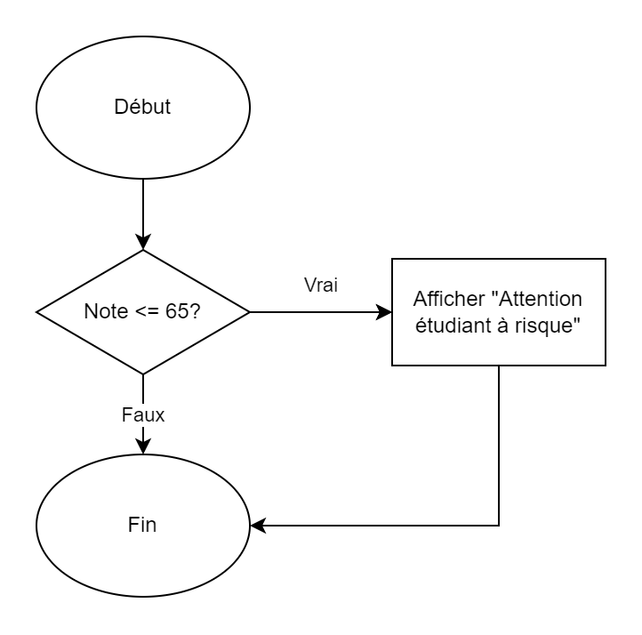
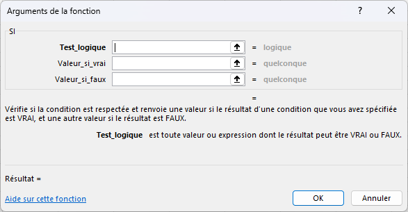
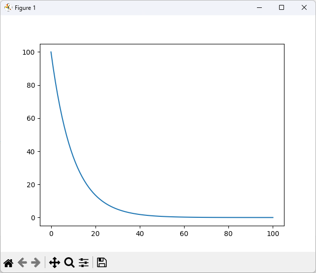

# Cours express sur la programmation <!-- omit in toc -->

# Table des matières <!-- omit in toc -->

- [Introduction](#introduction)
- [Que peut-on faire avec Python?](#que-peut-on-faire-avec-python)
- [Les plans de leçons](#les-plans-de-leçons)
  - [Plan de leçon 1 : Introduction à la programmation et fonctions de base](#plan-de-leçon-1--introduction-à-la-programmation-et-fonctions-de-base)
  - [Plan de leçon 2 : Contrôle de flux et les listes](#plan-de-leçon-2--contrôle-de-flux-et-les-listes)
  - [Plan de leçon 3 : Les boucles, fonctions avancées et visualisation avec Matplotlib](#plan-de-leçon-3--les-boucles-fonctions-avancées-et-visualisation-avec-matplotlib)
- [Leçon 1 : Introduction à la programmation et fonctions de base](#leçon-1--introduction-à-la-programmation-et-fonctions-de-base)
  - [Objectifs](#objectifs)
  - [Contenu](#contenu)
  - [Introduction à la programmation et à Thonny - 5 minutes](#introduction-à-la-programmation-et-à-thonny---5-minutes)
    - [Installation de Thonny - 8 minutes](#installation-de-thonny---8-minutes)
    - [Tour d'horizon de Thonny - 10 minutes](#tour-dhorizon-de-thonny---10-minutes)
    - [Tester Thonny - 5 minutes](#tester-thonny---5-minutes)
  - [Concepts fondamentaux de la programmation](#concepts-fondamentaux-de-la-programmation)
        - [Code base](#code-base)
    - [Les opérateurs mathématiques](#les-opérateurs-mathématiques)
  - [Écriture de programmes simples - 10 minutes](#écriture-de-programmes-simples---10-minutes)
  - [Introduction aux fonctions - 45 minutes](#introduction-aux-fonctions---45-minutes)
    - [Création de fonctions](#création-de-fonctions)
    - [Extra : Règles de nomenclatures](#extra--règles-de-nomenclatures)
- [Leçon 2 : Contrôle de flux et les listes](#leçon-2--contrôle-de-flux-et-les-listes)
  - [Objectifs](#objectifs-1)
  - [Contenu](#contenu-1)
  - [Révision des concepts abordés dans la première séance](#révision-des-concepts-abordés-dans-la-première-séance)
  - [Structures de contrôle de flux](#structures-de-contrôle-de-flux)
    - [Opérateurs de comparaison](#opérateurs-de-comparaison)
      - [Table de vérité](#table-de-vérité)
    - [Autres exemples](#autres-exemples)
  - [La valeur **`None`**](#la-valeur-none)
    - [Exemple d'utilisation de `None`](#exemple-dutilisation-de-none)
  - [Les listes en Python](#les-listes-en-python)
    - [Qu'est-ce qu'une liste en Python ?](#quest-ce-quune-liste-en-python-)
    - [Afficher une liste](#afficher-une-liste)
    - [Stocker des données scientifiques](#stocker-des-données-scientifiques)
    - [Manipuler des données](#manipuler-des-données)
      - [Ajouter et supprimer des éléments](#ajouter-et-supprimer-des-éléments)
      - [Calculer des statistiques](#calculer-des-statistiques)
    - [Résumé des fonctions utiles pour les listes](#résumé-des-fonctions-utiles-pour-les-listes)
  - [Les boucles](#les-boucles)
    - [En Python](#en-python)
    - [Boucle `for`](#boucle-for)
    - [Boucle `while`](#boucle-while)
    - [Sortir d'une boucle](#sortir-dune-boucle)
  - [Résumé de la leçon](#résumé-de-la-leçon)
  - [Exercices pour la prochaine séance](#exercices-pour-la-prochaine-séance)
  - [Extra](#extra)
- [Leçon 3 : Librairie Numpy et visualisation avec Matplotlib](#leçon-3--librairie-numpy-et-visualisation-avec-matplotlib)
- [Références](#références)

# Introduction

Cet article se veut comme un cours rapide sur les bases de la programmation pour pouvoir créer des outils. Il est destiné à des personnes qui ont déjà une base en science et qui veulent utiliser la programmation pour faire des analyses de données, des calculs, des graphiques, etc. Il est aussi destiné à des personnes qui ont déjà une base en programmation mais qui veulent apprendre à utiliser Python. On prend aussi pour acquis que le lecteur connaît l'utilité de la programmation.

Ce cours est basé sur le langage Python. Il existe plusieurs langages de programmation, mais Python est un langage très populaire et très utilisé dans le monde de la science. Il est aussi très facile à apprendre et à utiliser. Il est donc un bon choix pour commencer à apprendre la programmation.

On séparera ce cours en trois leçons d'une heure. La première leçon se consacrera sur la programmation de base, la deuxième sur le contrôle de flux et boucles et la troisième sur les fonctions, les modules et l'affichage de graphiques.

# Que peut-on faire avec Python?

Voici des exemples d'outils créés avec Python ou encore des possibilités.


# Les plans de leçons

## Plan de leçon 1 : Introduction à la programmation et fonctions de base

Durée : 1 heure

-   Introduction à la programmation et à Thonny.
-   Concepts fondamentaux de la programmation : variables, types de données, opérations mathématiques.
-   Écriture de programmes simples pour effectuer des calculs.
-   Introduction aux fonctions : définition, paramètres, valeurs de retour.
-   Exercices pratiques pour créer et appeler des fonctions simples.

## Plan de leçon 2 : Contrôle de flux et les listes

Durée : 1 heure

-   Révision des concepts abordés dans la première séance.
-   Structures de contrôle de flux : if, else, elif.
-   Les listes
-   Exercices pratiques pour créer des programmes avec des structures de contrôle et des listes
-   Introduction à l'utilisation de Thonny pour déboguer les erreurs.

## Plan de leçon 3 : Les boucles, fonctions avancées et visualisation avec Matplotlib

Durée : 1 heure

-   Révision des concepts abordés dans les séances précédentes.
-   Les boucles : while et for.
-   Fonctions avec des valeurs de retour et utilisation avancée de fonctions.
-   Introduction à la bibliothèque Matplotlib pour la visualisation de données.
-   Création de graphiques simples avec Matplotlib.
-   Exercices pratiques pour créer des programmes plus complexes avec des fonctions et générer des graphiques.

Chaque séance d'une heure se concentre sur des concepts spécifiques et propose des exercices pratiques pour renforcer les compétences acquises. Les plans seront adaptés en fonction du niveau de familiarité des enseignants avec la programmation.

---

# Leçon 1 : Introduction à la programmation et fonctions de base

**Durée : 1 heure**

## Objectifs

-   Comprendre les concepts fondamentaux de la programmation.
-   Apprendre à utiliser l'outil de développement Thonny.
-   Créer des programmes simples pour effectuer des calculs.
-   Comprendre et créer des fonctions en Python.

## Contenu

1.  **Introduction à la programmation et à Thonny**
    -   Présentation de l'interface Thonny.
    -   Présentation des concepts de base de la programmation.

2.  **Concepts fondamentaux de la programmation**
    -   Variables et types de données (entiers, flottants, chaînes de caractères).
    -   Opérations mathématiques en Python.

3.  **Écriture de programmes simples**
    -   Utilisation de l'éditeur Thonny pour écrire et exécuter du code.
    -   Création de programmes simples pour effectuer des calculs.

4.  **Introduction aux fonctions**
    -   Comprendre le concept de fonction.
    -   Définition de fonctions en Python.
    -   Paramètres et valeurs de retour des fonctions.

5.  **Exercices pratiques**
    -   Création de fonctions simples pour effectuer des calculs spécifiques.
    -   Appel de fonctions avec différents arguments.
    -   Utilisation de fonctions pour résoudre des problèmes simples.

## Introduction à la programmation et à Thonny - 5 minutes

-   La programmation est un moyen de donner des instructions à un ordinateur pour résoudre des problèmes.
-   Thonny est un environnement de développement Python qui facilite l'écriture, l'exécution et le débogage de code.

Voici une capture d'écran de Thonny avec un peu de code. Prenez quelques instants pour regarder l'interface et les différents éléments.


Vous reconnaissez probablement la formule ci-dessus soit la loi sur les gaz parfaits. Plus tard, nous allons utiliser cette formule pour faire des calculs simples.

### Installation de Thonny - 8 minutes

Pour l'installation de Thonny, on doit tout d'abord le télécharger sur le site officiel : <https://thonny.org/>


Il n'est pas nécessaire d'être administrateur pour installer Thonny. Vous pouvez donc l'installer sur votre ordinateur personnel.

> **Note :** L'installateur est en anglais, mais l'interface de Thonny est disponible en français. Lors de la première exécution, l'outil vous demandera de choisir la langue de l'interface.

Vidéo montrant l'installation de Thonny

[](https://www.youtube.com/watch?v=jYAvJqxHs5E)

Premier démarrage de Thonny


### Tour d'horizon de Thonny - 10 minutes

Thonny est un environnement de travail qui est très simple à utiliser. Il est donc parfait pour les débutants. Dans cette section, nous allons faire un tour d'horizon de Thonny.

Lorsque vous ouvrez Thonny, vous devriez voir une fenêtre qui ressemble à ceci :


Comme la majorité des applications Windows, on retrouve une barre de menu en haut de la fenêtre. Cette barre de menu contient les menus suivants :

-   `Fichier` : Contient les options pour créer, ouvrir, enregistrer et imprimer un fichier.
-   `Éditer` : Contient les options pour copier, couper, coller et annuler.
-   `Affichage` : Contient les options pour afficher ou masquer les différents panneaux de Thonny.
-   `Exécuter` : Contient les options pour exécuter le code.
-   `Outils` : Contient les options pour configurer Thonny.
-   `Aide` : Contient les options pour obtenir de l'aide sur Thonny.

En dessous de la barre de menu, on retrouve une barre d'outils. Cette barre d'outils contient les boutons suivants :

-   `Nouveau` : Permet de créer un nouveau fichier.
-   `Ouvrir` : Permet d'ouvrir un fichier existant.
-   `Enregistrer` : Permet d'enregistrer le fichier courant.
-   **`Exécuter`** : Permet d'exécuter le code.
-   `Déboguer` : Permet de déboguer le code.
    -   Quelques boutons en lien avec le débogage sont grisés. Nous verrons en cours de session comment les utiliser.
-   `Arrêter` : Permet d'arrêter l'exécution du code.

En dessous de la barre d'outils, on retrouve la fenêtre principale de Thonny. Lors de la première exécution, cette fenêtre est divisée en deux parties :

-   La partie du haut est l'éditeur de code. C'est dans cette partie que vous allez écrire votre code.
-   La partie du bas est la console. C'est dans cette partie que vous allez voir le résultat de l'exécution de votre code.

### Tester Thonny - 5 minutes

Pour tester Thonny, nous allons écrire un petit programme qui calcule la pression d'un gaz parfait. Voici le code à coller dans l'éditeur de code :

```python
# Variables
# Données d'entrée
n = 2.5     # Moles de gaz
R = 0.0821  # Constante des gaz parfaits (L.atm/mol.K)
T = 300     # Température en Kelvin
V = 10      # Volume en litres

# Formules
# Calcul de la pression en utilisant la formule PV = nRT
P = (n * R * T) / V

# Affichage du résultat
print("Données d'entrée:")
print("Moles de gaz (n) :", n)
print("Constante des gaz (R) :", R)
print("Température (T) :", T, "K")
print("Volume (V) :", V, "L")

print("\nCalcul de la pression (P) :")
print("Pression (P) =", P, " atm")
```

Appuyez sur le bouton `Exécuter` (ou `Play`) pour exécuter le code. Vous devriez voir le résultat dans la console.

L'analyse du code se fera dans la partie suivante.

* * *

## Concepts fondamentaux de la programmation

Dans cette section, nous allons voir les concepts fondamentaux de la programmation. Nous allons voir les variables, les types de données et les opérations mathématiques.

Voici le code que nous avons écrit dans la section précédente :
##### Code base
```python
# Variables
# Données d'entrée
n = 2.5     # Moles de gaz
R = 0.0821  # Constante des gaz parfaits (L.atm/mol.K)
T = 300     # Température en Kelvin
V = 10      # Volume en litres

# Formules
# Calcul de la pression en utilisant la formule PV = nRT
P = (n * R * T) / V

# Affichage du résultat
print("Données d'entrée:")
print("Moles de gaz (n) :", n)
print("Constante des gaz (R) :", R)
print("Température (T) :", T, "K")
print("Volume (V) :", V, "L")

print("\nCalcul de la pression (P) :")
print("Pression (P) =", P, " atm")
```

-   **Commentaires :**
    -   Le symbole `#` est utilisé pour faire des commentaires. Tout ce qui suit le symbole `#` sur une ligne est ignoré par l'interpréteur Python. Ils sont utilisés pour expliquer le code et rendre le code plus lisible. 
-   **Variables :**
    -   Dans les premières lignes, on remarque des lettres (`n`, `R`, `T` et `V`) suivis du symbole `=`. Ces lignes sont des déclarations de variables.
    -   Une variable est un espace mémoire qui contient une valeur. Dans le cas présent les valeurs sont de type numérique. Ces valeurs peuventt être de différents types. Nous verrons les types de données plus loin.
    -   Pour pouvoir faire des calculs, on doit utiliser des variables. Les variables sont utilisées pour stocker des valeurs qui seront utilisées dans des calculs.
-   **L'assignation :**
    -   Le symbole `=` est utilisé pour assigner une valeur à une variable. On appelle cela l'assignation.
    -   L'assignation est une opération qui consiste à stocker une valeur dans une variable.
    -   L'assignation se fait de la façon suivante : `variable = valeur`
    -   L'assignation se fait de la droite vers la gauche. La valeur est assignée à la variable.
-   **Expressions :**
    -   La lignes `P = (n * R * T) / V` est une expression arithmétique dont la valeur est assignée à la variable `P`. Une expression est une combinaison de valeurs, de variables et d'opérateurs. Lorsque l'interpréteur Python évalue une expression, il produit une valeur.
    -   En programmation, la priorité des opérations est la même qu'en mathématiques. Les opérations entre parenthèses sont effectuées en premier, les exposants, et ainsi de suite. (Les PEMDAS)
-   **Affichage :**
    -   La fonction `print()` est utilisée pour afficher du texte et des valeurs à l'écran.
    -   Elle peut prendre plusieurs paramètres séparés par des virgules. Elle affichera les paramètres séparés par un espace.
        -   `print("Bonjour", "tout", "le", "monde")` affichera `Bonjour tout le monde`.
        -   Dans l'exemple précédent, la ligne `print("Température (T) :", T, "K")` affichera `Température (T) : 300 K`.

### Les opérateurs mathématiques

Voici un tableau des opérateurs mathématiques de base en Python :

| Opérateur | Description                                          | Exemple  |
| :-------: | :--------------------------------------------------- | :------- |
|    `+`    | Addition                                             | `2 + 3`  |
|    `-`    | Soustraction                                         | `2 - 3`  |
|    `*`    | Multiplication                                       | `2 * 3`  |
|    `/`    | Division                                             | `2 / 3`  |
|    `**`   | Exposant                                             | `2 ** 3` |
|    `//`   | Division entière (Donne le quotient de la division.) | `2 // 3` |
|    `%`    | Modulo (Donne le reste de la division.)              | `2 % 3`  |

* * *

## Écriture de programmes simples - 10 minutes

Modifiez le [code précédent](#code-base) pour trouver une solution propre à votre domaine d'enseignement.

Quelques idées :

-   **Physique :** Vitesse d'un objet en chute libre.
-   **Chimie :** Concentration d'une solution.
-   **Mathématiques :** Calcul de la moyenne de notes.
-   **Biologie :** Seuil d'immunité collective.

* * *

## Introduction aux fonctions - 45 minutes

Dans cette section, nous allons voir les fonctions. Nous allons voir ce qu'est une fonction, comment la définir et comment l'appeler.

Une fonction est un bloc de code qui effectue une tâche spécifique. Une fonction peut prendre des paramètres en entrée et peut retourner une valeur en sortie. Une fonction peut être appelée à partir d'un autre code pour effectuer une tâche spécifique.

Par exemple sur les calculatrices scientifiques, on retrouve les fonctions trigonométriques. Ces fonctions prennent un angle en entrée et retournent la valeur du sinus, du cosinus ou de la tangente de cet angle.

Python fournit les fonctions de mathématiques de base dans le module `math`. Pour utiliser ces fonctions, on doit importer le module `math` dans notre code. Voici un exemple :

```py
# Importation du module math
import math

angle = 45
rad = math.radians(angle)
resultat = math.sin(rad)

print("Sinus de", angle, "degrés :", resultat)
```

> **Note :** Nous verrons en détail l'importation de modules dans une leçon future.

**Analyse du code**

```py
import math
```

Cette ligne importe le module `math` dans notre code. Cela nous permet d'utiliser les fonctions du module `math`.

```py
angle = 45
rad = math.radians(angle)  
```

Ces lignes définissent une variable `angle` et assignent la valeur `45` à cette variable. La ligne suivante définit une variable `rad` et assigne la valeur de la fonction `math.radians(angle)` à cette variable. La fonction `math.radians(angle)` prend un angle en degrés en entrée et retourne la valeur de cet angle en radians.

Les ordinateurs utilisent les radians pour faire des calculs trigonométriques. Il est donc nécessaire de convertir les angles en radians avant de faire des calculs trigonométriques.

```py
resultat = math.sin(rad)
```

Cette ligne définit une variable `resultat` et assigne la valeur de la fonction `math.sin(rad)` à cette variable. La fonction `math.sin(rad)` prend un angle en radians en entrée et retourne la valeur du sinus de cet angle.

```py
print("Sinus de", angle, "degrés :", resultat)
```

Cette ligne affiche le résultat du calcul. La fonction `print()` prend plusieurs paramètres en entrée et affiche ces paramètres à l'écran. Dans le cas présent, la fonction `print()` affiche le texte `Sinus de`, la valeur de la variable `angle`, le texte `degrés :` et la valeur de la variable `resultat`.

* * *

### Création de fonctions

Python offre plusieurs fonctions de base, mais souvent on doit créer nos propres fonctions pour effectuer des tâches spécifiques. Voici un exemple de fonction calculant le sinus d'un angle en degrés :

```py
def sinus(angle):
    rad = math.radians(angle)
    resultat = math.sin(rad)
    return resultat

angleA = 45
resultatA = sinus(angleA)

angleB = 60
resultatB = sinus(angleB)


print("Sinus de", angleA, "degrés :", resultatA)
print("Sinus de", angleB, "degrés :", resultatB)
```

Pour créer une fonction, on doit utiliser une syntaxe spécifique.

La syntaxe générale pour créer une fonction est la suivante :

```py
def nom_de_la_fonction([paramètres [, ...]]):
    '''Documentation de la fonction (optionnel)'''
    # Corps de la fonction
    # ...
    return valeur_de_retour # Optionnel
```

-   Le mot-clé `def` est utilisé pour définir une fonction.
-   Le **nom de la fonction** doit être unique. Il est recommandé d'utiliser un nom qui décrit la fonction.
-   Les **paramètres** sont des valeurs qui sont passées à la fonction. **Les paramètres sont optionnels**. Si la fonction ne prend pas de paramètres, on doit quand même mettre les parenthèses. Cela permet de distinguer une fonction d'une variable.
    -   Les paramètres sont séparés par des virgules.
    -   Les paramètres sont des variables locales à la fonction. Elles ne sont pas accessibles à l'extérieur de la fonction.
-   **`return`** est utilisé pour retourner une valeur à l'appelant.
    -   `return` termine l'exécution de la fonction.
    -   `return` peut retourner une valeur ou une expression.
    -   `return` peut retourner plusieurs valeurs séparées par des virgules.
    -   `return` peut être utilisé pour retourner une valeur avant la fin de la fonction.
    -   `return` est optionnel. Si la fonction ne retourne pas de valeur, on peut omettre le `return`.

> **Note :** Dans la littérature technique, les caractères `[]` indiquent que le contenu est optionnel. Dans la syntaxe ci-dessus, les paramètres sont optionnels. On peut donc écrire `def nom_de_la_fonction():` si la fonction ne prend pas de paramètres.

Aspects importants à retenir :

-   Une fonction ne fait rien tant qu'elle n'est pas appelée.
-   Les lignes de code qui définissent une fonction doivent être indentées.
    -   L'indentation est le fait de décaler le texte vers la droite.
    -   L'indentation est généralement de 4 espaces.
    -   L'indentation est utilisée pour définir les blocs de code.
    -   L'indentation est utilisée pour rendre le code plus lisible.
    -   L'indentation est obligatoire en Python.

Voici quelques exemples de fonctions :

```py
import datetime
import math

# Fonction affichant un message
def afficher_erreur():
    print("Il y a une erreur, veuillez recommencer!")
    # Le return optionnel ici, car 
    # on ne fait qu'afficher un message

# Fonction retournant l'heure du système
def get_heure():
    # Il faudra importer le module datetime
    # pour utiliser cette fonction
    return datetime.datetime.now().time()

# Aire d'un cercle
def calculer_aire_cercle(rayon):
  return 3.14159 * rayon ** 2

# Fonction retournant la moyenne de trois nombres
def calculer_moyenne(a, b, c):
  somme = (a + b + c)
  return somme / 3

# Fonction retournant la vitesse finale en fonction
# de la vitesse initiale, de l'accélération et du temps
def calculer_vitesse_finale(v0, a, t):
  vt = a * t
  return v0 + vt

# Fonction retournant l'énergie potentielle
def calculer_energie_potentielle(m, dY):
  return m * 9.8 * dY

# Fonction retournant l'énergie cinétique
def calculer_energie_cinetique(m, v):
  return (m * v ** 2) / 2

# Fonction retournant l'énergie mécanique
def calculer_energie_mecanique(m, v, dY):
  # On peut utiliser des fonctions dans d'autres fonctions
  ek = energie_cinetique(m, v)
  ep = energie_potentielle(m, dY)
  return ek + ep

# Fonction retournant la pression
def calculer_pression(n, R, T, V):
  return (n * R * T) / V

# Fonction retournant la masse finale d'un échantillon en fonction
# de sa masse initiale, du temps et de la demi-vie
def calculer_decroissance_exponentielle(m0, t, demi_vie):
    return m0 * math.exp(-t / demi_vie)

# Exemple d'utilisation
afficher_erreur()
print( get_heure())
print (calculer_moyenne (65, 23, 12))
print (calculer_aire_cercle(5))
print (calculer_vitesse_finale(10, 5, 2))
print (calculer_energie_potentielle(10, 5))
print (calculer_energie_cinetique(10, 5))
print (calculer_energie_mecanique(10, 5, 2))
print (calculer_pression(2.5, 0.0821, 300, 10))
print (calculer_decroissance_exponentielle(100, 10, 5))
```

On remarque que la syntaxe est toujours similaire et respecte les règles énoncées plus haut.

### Extra : Règles de nomenclatures

En plus des règles de syntaxes, les langages de programmations ont tous des règles de nomenclatures. Ces règles sont des conventions qui permettent de rendre le code plus lisible. Vous remarquez que les fonctions débutent tous par un verbe. Voici quelques règles de nomenclatures pour Python:

-   Les noms de fonctions ou variables doivent être en minuscules.
-   Les noms de fonctions ou variables doivent être séparés par des underscores (trait souligné).
-   Si c'est une action, le nom de la fonction doit débuter par un verbe.

Pour la majorité des langages de programmation, les règles de nomenclatures sont les suivantes :

-   Les noms ne doivent contenir que des lettres, des chiffres et des underscores (\_).
-   Les noms ne doivent pas débuter par un chiffre.
-   Les noms doivent être en un seul mot, i.e. aucun espace.

Voici un tableau d'exemples valides et non valides :

| Nom Valide         | Nom non valide                                             |
| :----------------- | :--------------------------------------------------------- |
| `balance_actuelle` | `balance-actuelle` (Le tirait n'est pas valide)            |
| `niveauPH`         | `niveau pH` (Les espaces ne sont pas permis)               |
| `vitesse0`         | `0vitesse` (Ne peut pas débuter avec un chiffre)           |
| `_42`              | `42` (Ne peut pas débuter avec un chiffre)                 |
| `total_somme`      | `total_$omme` (Les caractères spéciaux ne sont pas permis) |
| `densite`          | `densité` (Les accents sont proscrits)                     |

---

**Exercice 1 : Conversion de température**
Écrivez une fonction appelée `convertir_c_en_f` qui prend une température en degrés Celsius en tant que paramètre et renvoie la température équivalente en degrés Fahrenheit. La formule de conversion est : $Fahrenheit = (Celsius × 9/5) + 32$.

**Exercice 2 : Calcul de la surface d'un rectangle**
Écrivez une fonction appelée `calculer_surface_rectangle` qui prend la longueur et la largeur d'un rectangle en tant que paramètres et renvoie sa surface.

-   Écrivez une fonction appelée `calculer_surface_carre` qui prend la longueur d'un côté d'un carré en tant que paramètre et renvoie sa surface. Cependant, utilisez la fonction `calculer_surface_rectangle` pour effectuer le calcul.


> **Devoir : Fonctions en lien avec votre domaine d'enseignement** <br />
> Quelle serait un cours sans devoir! Voici votre devoir :<br />
> 1. Écrivez quelques fonctions en lien avec votre domaine d'enseignement. Vous pouvez utiliser les exemples ci-dessus pour vous inspirer.<br />
> 2. Dans le prochain cours, nous allons voir les boucles. Pensez à des situations où vous aimeriez voir des calculs variant selon des paramètres. Par exemple, en physique, on peut calculer la vitesse finale d'un objet en chute libre en fonction de la hauteur de départ. Vous pouvez aussi trouver des situations où vous aimeriez voir des graphiques. Par exemple, en chimie, on peut tracer un graphique de la concentration d'une solution en fonction du temps.<br />
> 
> Vous pouvez me contacter via Teams pour regarder votre code et répondre à vos questions.

* * *

# Leçon 2 : Contrôle de flux et les listes

**Durée : 1 heure**

## Objectifs

-   Réviser les concepts abordés dans la première séance.
-   Apprendre à utiliser les structures de contrôle de flux.
-   Apprendre à utiliser la valeur `None`
-   Apprendre à utiliser les listes
-   Apprendre à utiliser Thonny pour déboguer les erreurs.
-   Créer des programmes en utilisant des listes et des structures de contrôle de flux.
## Contenu

1.  **Bref retour sur les concepts abordés dans la première séance**
    -   Variables et types de données (entiers, flottants, chaînes de caractères).
    -   Opérations mathématiques en Python.
    -   Définition de fonctions en Python.
2.  **Structures de contrôle de flux**
3.  **La valeur `None`**
4.  **Les listes**
5.  **Exercices pratiques**
    -   Création de programmes avec des structures de contrôle et des boucles.
    -   Utilisation de Thonny pour déboguer les erreurs.

## Révision des concepts abordés dans la première séance

Voici quelques questions pour réviser les concepts abordés dans la première séance :

1.  Qu'est-ce qu'une variable?
2.  Qu'est-ce que l'assignation?
3.  Qu'est-ce qu'une expression?
4.  Qu'est-ce qu'une fonction?
5.  Qu'est-ce que l'indentation?
6.  Quelles sont les règles générales de nomenclatures en Python?
7.  Quelles fonctions avez-vous créées dans votre devoir?

## Structures de contrôle de flux

Les structures de contrôle de flux permettent de contrôler l'exécution du code. Elles permettent de faire des choix selon des conditions. Elles permettent aussi de répéter des instructions.

En français, on utilise les mots `si`, `sinon` et `sinon si` pour faire des choix. En programmation, on utilise les mots `if`, `else` et `elif` (*contraction de else if*).

On utilise parfois un diagramme à flux de données pour représenter les structures de contrôle de flux. Voici un exemple :



> **Comparaison avec Excel** <br />
> Si vous avez déjà utilisé Excel, vous avez probablement utilisé les fonctions `SI` et `SOMME.SI`. Ces fonctions sont des structures de contrôle de flux. Elles permettent de faire des choix selon des conditions.

Voici la **structure générale** de contrôle de flux en Python:

```py
if condition 1:
    # Instructions si condition 1 vrai

# Optionnel
elif condition N: 
    # Instructions si condition N vrai

# Optionnel
else: 
    # Instructions si toutes les conditions sont fausses
```

> **Comparaison Excel** <br />
> `=si(condition; valeur_si_vrai; valeur_si_faux)`<br />
> <br />

**Seul le `if` est obligatoire**. On peut avoir plusieurs `elif` et un seul `else`. On peut aussi avoir seulement un `if` et un `else`.

> **Note :** Remarquez qu'après la condition, il y a un "`:`". On note aussi que les instructions suivant la condition sont indentées. C'est une syntaxe spécifique à Python.
> 
> Le nombre d'espaces standard est de 4 ([Src : PEP 8](https://peps.python.org/pep-0008/#indentation)). Il est aussi possible de mettre des tabulations. Cependant, il faut être cohérent. Il est proscrit de mélanger les espaces et les tabulations.


Voici un exemple que vous pouvez tester:

```py
# Variables
age = 18

# Structure de contrôle de flux
if age < 5:
    print("Gratuit")
elif age < 12:
    print("Tarif enfant")
elif age < 65:
    print("Tarif adulte")
else:
    print("Tarif aîné")
```

Dans un `if`, il y a une condition. La condition est une expression booléenne. Une expression booléenne est une expression qui retourne `True` ou `False`. Si la condition est `True`, les instructions dans le `if` sont exécutées. Si la condition est `False`, les instructions dans le `if` sont ignorées.

Voici un autre exemple :

```py
# Variables
age = 18

if (age >= 18):
    print("Vous êtes un adulte")
else:
    print("Vous êtes un mineur")
```

Voici le code qui représente le diagramme de flux montré plus haut :

```py
# Variables
note = 70

if note <= 65:
    print ("Attention, risque d'échec!")

```

On peut mettre des structures conditionnelles à l'intérieur des fonctions.

Voici un exemple :

```py
# Fonction indiquant si le pH est acide, neutre ou basique
def type_pH(pH):
    if pH < 7:
        print("Acide")
    elif pH > 7:
        print("Basique")
    else:
        print("Neutre")

# Appel de la fonction
type_pH(7.5)
```

> **Note :** On remarque toujours l'indentation dans les structures de contrôle de flux. Cela facilite la lecture en bloc. On rappel que l'indentation est obligatoire en Python.

### Opérateurs de comparaison

Les expressions conditionnelles utilisent des opérateurs de comparaison. Voici un tableau des opérateurs de comparaison de base :

| Opérateur | Description          | Exemple   |
| :-------: | :------------------- | :-------- |
|    `==`   | Égalité              | `a == b`  |
|    `!=`   | Différence           | `a != b`  |
|    `>`    | Plus grand que       | `a > b`   |
|    `<`    | Plus petit que       | `a < b`   |
|    `>=`   | Plus grand ou égal à | `a >= b`  |
|    `<=`   | Plus petit ou égal à | `a <= b`  |
|   `not`   | Négation             | `not a`   |
|   `and`   | ET logique           | `a and b` |
|    `or`   | OU logique           | `a or b`  |

Dans tous les cas, l'expression retourne `True` ou `False`. `a` ou `b` peuvent être des variables ou des expressions.

Voici un exemple :

```py
# Variables
age = 18
ami = True

# Structure de contrôle de flux
if age >= 18 and ami:
    print("On va au Trou du Diable!")
else:
    print("On va dans ton sous-sol!")
```

> **Attention erreur fréquente!** <br />
> Dans les expressions conditionnelles, on utilise `==` pour vérifier l'égalité. On utilise `=` pour assigner une valeur à une variable. <br />
> Si votre code ne fonctionne pas, vérifiez que vous n'avez pas utilisé `=` au lieu de `==`.

#### Table de vérité 
Voici un petit rappel de la table de vérité pour les opérateurs logiques `and` et `or` :

| `a`  | `b`  | `a and b` | `a or b` |
| :--: | :--: | :-------: | :------: |
| `T`  | `T`  |    `T`    |   `T`    |
| `T`  | `F`  |    `F`    |   `T`    |
| `F`  | `T`  |    `F`    |   `T`    |
| `F`  | `F`  |    `F`    |   `F`    |

En résumé pour le `ET`, il faut que les deux conditions soient vrai pour que l'expression soit vrai. Pour le `OU`, il faut qu'au moins une des conditions soit vrai pour que l'expression soit vrai.

### Autres exemples

Voici une liste d'exemples où l'on pourrait devoir utiliser des structures de contrôle de flux avec conditions multiples :
- **Science générale :** Trouver la bonne formule à appliquer selon les données d'entrée, i.e. quelle est l'inconnue.
- **Géométrie :** Déterminer s'il y a collision entre deux rectangles.
- **Administration :** Déterminer si un étudiant est admissible à un programme.

## La valeur **`None`**

En Python, il y a une valeur spéciale qui est `None`. Cette valeur est utilisée pour indiquer qu'une variable n'a pas de valeur. On peut l'utiliser pour initialiser une variable. On peut aussi l'utiliser pour indiquer qu'une fonction ne retourne pas de valeur.

Elle peut être utilisé pour initialiser une variable que l'on va utiliser plus tard. Par exemple, on peut utiliser `None` pour initialiser une variable qui va contenir le résultat d'un calcul.

### Exemple d'utilisation de `None`
Les opérateurs de comparaison en combinaison de `None` sont très utiles pour faire des choix. Par exemple dans le cas où l'on doit utiliser la bonne formule dépendant des données d'entrée.

Voici un exemple dans lequel on a différente fonction $PV=nRT$ dépendant des données d'entrée :

```py
# Variables
R = 0.0821  # Constante des gaz parfaits (L.atm/mol.K)

# Essayez de remplacer une valeur par None pour
# voir le résultat
n = 2.5     # Moles de gaz
T = 300     # Température en Kelvin
V = 10      # Volume en litres
P = None    # Pression en atm

msg = ''

# Structure de contrôle de flux
if n == None:
    # Cas où n est l'inconnue
    n = (P * V) / (R * T)
    msg = "Moles de gaz (n) :" + str(n)
elif T == None:
    # Cas où T est l'inconnue
    T = (P * V) / (R * n)
    msg = "Température (T) :" + str(T) + " K"
elif V == None:
    # Cas où V est l'inconnue
    V = (n * R * T) / P
    msg = "Volume (V) :" + str(V) + " L"
elif P == None:
    # Cas où P est l'inconnue
    P = (n * R * T) / V
    msg = "Pression (P) :" + str(P) + " atm"
else:
    # Cas où il y a une erreur
    msg = "Revérifiez vos données d'entrée. Il y a une erreur, car toutes les variables sont définies."

# Affichage du résultat
print ("Voici le résultat :")
print (msg)

```

Voici par exemple une fonction qui retourne la valeur manquante dans la loi des gas parfaits :

```py
def ideal_gas_law(P=None, V=None, n=None, T=None):
    # Constante
    R = 0.0821  # Constante des gaz parfaits (L.atm/mol.K)

    if P == None:
        return (n * R * T) / V
    elif V == None:
        return (n * R * T) / P
    elif n == None:
        return (P * V) / (R * T)
    elif T == None:
        return (P * V) / (n * R)
    else:
        return None


# Tests de la fonction
print(ideal_gas_law(P=1, V=1, n=1), "K")
print(ideal_gas_law(P=1, V=1, T=1), "mol")
print(ideal_gas_law(P=1, n=1, T=1), "L")
print(ideal_gas_law(V=1, n=1, T=1), "atm")
```

**Explication de la fonction**

La fonction `ideal_gas_law` prend en paramètre les variables `P`, `V`, `n` et `T`. Ces variables sont initialisées à `None` par défaut. Cela permet de ne pas avoir à spécifier tous les paramètres lors de l'appel de la fonction.

> **Nouveauté : Valeur par défaut** <br />
> On peut donner des valeurs par défaut à des paramètres. Cela permet de ne pas avoir à spécifier tous les paramètres lors de l'appel de la fonction. <br/>
>

> **Nouveauté : Paramètre spécifié** <br />
> On peut spécifier les paramètres lors de l'appel de la fonction. Cela permet de ne pas avoir à respecter l'ordre des paramètres. <br/>
> Dans l'exemple précédent, on peut voir dans les tests que l'on a spécifié les paramètres `P`, `V`, `n` et `T` dans un ordre différent de la définition de la fonction. 

---


## Les listes en Python


L'une des structures de données les plus fondamentales en Python est la liste, qui peut être un outil puissant pour stocker, organiser et manipuler des données. Dans cette partie, nous explorerons l'utilisation des listes en Python.

### Qu'est-ce qu'une liste en Python ?

Une liste en Python est une collection ordonnée d'éléments. Ces éléments peuvent être de différents types de données, tels que des nombres, des chaînes de caractères, des booléens, voire même d'autres listes. Les listes sont déclarées en utilisant des crochets `[]` et en séparant les éléments par des virgules. Voici un exemple simple :

```python
# Déclaration d'une liste de nombres
ma_liste = [1, 2, 3, 4, 5]
```

### Afficher une liste
Pour afficher le contenu d'une liste, vous pouvez utiliser la fonction `print()`.

```python
# Afficher le contenu de la liste
print(ma_liste)
```

Pour afficher un élément spécifique de la liste, vous pouvez utiliser l'index de cet élément. Par exemple, pour afficher le deuxième élément de la liste, utilisez `print(ma_liste[1])`.

```python
# Afficher le premier élément de la liste
print(ma_liste[0])

# Afficher le deuxième élément de la liste
print(ma_liste[1])
```

Vous avez probablement remarqué que les index commencent à 0. Cela signifie que le premier élément d'une liste a un index de 0, le deuxième élément a un index de 1, et ainsi de suite.

> **Perle de culture : Pourquoi les index débutent par 0** <br />
> Dans les années 60, les langages de programmation étaient écrits en assembleur. Les tableaux étaient stockés dans la mémoire de l'ordinateur (Ils le sont toujours.). Pour accéder à un  tableau, on utilisait l'adresse mémoire du tableau. L'adresse mémoire du premier élément était "**adresse_memoire + (index * taille_element)**". Les langages subséquents ont conservés cette convention et c'est pourquoi les index débutent par 0. <br />

### Stocker des données scientifiques

En tant que personne de sciences, vous pouvez utiliser des listes pour stocker des données expérimentales, des résultats d'observations ou des séquences de mesures. Par exemple, si vous effectuez des mesures de la température et de la vitesse du vent à différents moments de la journée, vous pouvez stocker ces valeurs dans une liste :

```python
temperatures = [23.5, 25.2, 22.8, 26.1, 21.9]
vitesses_vent = [12, 15, 11, 13, 14]
```


### Manipuler des données
Une fois que vous avez stocké des données dans une liste, vous pouvez les manipuler de différentes manières. Voici quelques opérations courantes que vous pouvez effectuer avec des listes.

Collez le code suivant dans Thonny et exécutez-le.

```python
temperatures = [23.5, 25.2, 22.8, 26.1, 21.9]
etudiants = ["Jean", "Marie", "Pierre", "Julie", "Sophie"]

# Accéder à la deuxième valeur de la liste temperature
print(temperatures[1])
print (etudiants[3])

# Construire une phrase avec les valeurs de la liste
print ("La température est de", temperatures[2], "degrés.")
print ("L'étudiant", etudiants[0], "a obtenu une température de", temperatures[0], "degrés.")
```


#### Ajouter et supprimer des éléments

Vous pouvez ajouter des éléments à une liste avec la méthode `append()`, et vous pouvez supprimer des éléments avec la méthode `remove()`. Par exemple, pour ajouter une nouvelle mesure de température à votre liste, utilisez `temperature.append(24.7)`, et pour supprimer une valeur spécifique, utilisez `temperature.remove(23.5)`.

Il y a aussi le méthode `pop()` qui permet de supprimer un élément à un indice spécifique. Par exemple, `temperature.pop(0)` supprime le premier élément de la liste `temperature`.

```python
print (temperatures)

# Ajouter une valeur à la liste
temperatures.append(24.7)
print (temperatures)

# Supprimer une valeur de la liste
temperatures.remove(23.5)
print (temperatures)

# Supprimer une valeur à un indice spécifique
temperatures.pop(0)
print (temperatures)
```

#### Calculer des statistiques

Python offre de nombreuses bibliothèques pour effectuer des calculs statistiques sur des listes de données. La bibliothèque `numpy` est particulièrement populaire pour ces tâches. Par exemple, vous pouvez calculer la moyenne des températures de votre liste avec `numpy` :

```python
# Importation de la bibliothèque numpy
# renommée en tant que np pour faciliter l'utilisation
import numpy as np

temperatures = [23.5, 25.2, 22.8, 26.1, 21.9]

# Calculer la moyenne des valeurs
mean_temperature = np.mean(temperatures)

# Calculer l'écart-type des valeurs
std_temperature = np.std(temperatures)

# Afficher les résultats
print("Les températures sont", temperatures)
print("La moyenne des températures est de", mean_temperature, "degrés.")
print("L'écart-type des températures est de", std_temperature, "degrés.")
```

> **Note :** Si vous avez une erreur du type `ModuleNotFoundError: No module named 'numpy'`, vous devez installer le module `numpy`. Pour ce faire, allez dans le menu `Outils` et sélectionnez `Gérer les paquets`. Dans la fenêtre qui s'ouvre, recherchez `numpy` et installez le paquet en cliquant dessus. Vous pouvez aussi utiliser la commande `pip install numpy` dans le terminal.

### Résumé des fonctions utiles pour les listes
Voici les principales fonctions utiles pour les listes :

| Fonction | Description | Exemple |
| :------: | :---------- | :------ |
| `append()` | Ajoute un élément à la fin de la liste | `ma_liste.append(5)` |
| `remove()` | Supprime un élément de la liste | `ma_liste.remove(5)` |
| `pop()` | Supprime un élément à un indice spécifique | `ma_liste.pop(0)` |
| `len()` | Retourne le nombre d'éléments dans la liste | `len(ma_liste)` |
| `min()` | Retourne la valeur minimale de la liste | `min(ma_liste)` |
| `max()` | Retourne la valeur maximale de la liste | `max(ma_liste)` |
| `sum()` | Retourne la somme des valeurs de la liste | `sum(ma_liste)` |

Avec la librairie `numpy`, on peut avoir d'autres fonctions utiles :
| Fonction | Description | Exemple |
| :------: | :---------- | :------ |
| `numpy.mean()` | Retourne la moyenne des valeurs de la liste | `numpy.mean(ma_liste)` |
| `numpy.std()` | Retourne l'écart-type des valeurs de la liste | `numpy.std(ma_liste)` |

---

## Les boucles


En programmation, il y a un concept qui s'appelle la répétition. Cela permet d'exécuter un bloc de code de manière répétée. 

On appelle cela une boucle. Généralement, on répétera une boucle tant qu'une condition spécifiée est vraie. Cela permet d'automatiser des tâches répétitives et est largement utilisé dans la programmation pour traiter des données, générer des motifs, et bien plus encore.

Imaginez que vous ayez une tâche à accomplir plusieurs fois, comme compter de 1 à 100 ou afficher un message plusieurs fois. Plutôt que de copier et coller le même code encore et encore, vous pouvez utiliser une boucle pour effectuer cette tâche de manière efficace.

### En Python

En Python, il existe deux principales structures de boucles, à savoir les boucles `for` et `while`. Chacune de ces structures est utilisée pour répéter un bloc de code plusieurs fois, mais elles sont utilisées dans des contextes légèrement différents en fonction des besoins spécifiques du programme.

### Boucle `for`

La boucle `for` est utilisée pour itérer sur une séquence (qui peut être une liste, un tuple, un dictionnaire, un ensemble ou une chaîne). Elle est souvent utilisée quand nous savons à l'avance combien de fois nous voulons que le bloc de code soit exécuté.

Exemple basique d'utilisation d'une boucle `for`:

```python
for i in range(5):  # i prend les valeurs de 0 à 4
    print(i)
```

Vous pouvez également itérer directement sur les éléments d'une liste ou d'une autre collection:

```python
matieres = ["Chimie", "Physique", "Mathématiques", "Programmation", "Biologie"]
for matiere in matieres:
    print(matiere)
```

> ***Nouveauté :*** `range(a, b)` est une fonction qui retourne une séquence de nombres de `a` à `b` où `b` est exclusif. On peut la traduire la plage de nombre entre `a` et `b` exclusif.
> 
> On peut aussi utiliser `range(6)` pour avoir une séquence de nombres de 0 à 5.
>
> Nous y reviendrons plus tard.

**Exemple**

Voici un exemple de boucle `for` qui permet de générer un graphique de la fonction $y = x^2$ :

```python
import matplotlib.pyplot as plt

# Création des listes
x = []
y = []

# Remplissage des listes
for i in range(-10, 11):
    x.append(i)
    y.append(i**2)

# Affichage du graphique
plt.plot(x, y)
plt.show()
```

<details><summary>Résultat</summary>


</details>

Voici un autre exemple où l'on génère le graphique de la demi-vie d'un élément radioactif :

```python
# Fonction retournant la masse finale d'un échantillon en fonction
# de sa masse initiale, du temps et de la demi-vie
def calculer_decroissance_exponentielle(m0, t, demi_vie):
    return m0 * math.exp(-t / demi_vie)

# Variables
m0 = 100
demi_vie = 10
t = 0
pas = 1

# Création des listes
temps = []
masses = []

# Remplissage des listes
while t <= 100:
    temps.append(t)
    masses.append(calculer_decroissance_exponentielle(m0, t, demi_vie))
    t += pas

# Affichage du graphique
plt.plot(temps, masses)
plt.show()
```

Si vous copiez le code de cet exemple, il y a aura des erreurs. Pourquoi?

<details><summary>Résultat</summary>

Réponse : Il manque les importations de bibliothèques. Il faut importer `matplotlib.pyplot` et `math`.



</details>

### Boucle `while`

La boucle `while` est utilisée pour exécuter un bloc de code tant qu'une condition spécifiée est vraie. Elle vérifie la condition avant d'entrer dans la boucle à chaque itération.

Elle se traduit en français par "tant que".

Souvent on l'utilise pour exécuter un bloc de code un nombre de fois indéterminé. On peut aussi l'utiliser pour exécuter un bloc de code tant qu'une condition est vraie.

Voici quelques exemples de code utilisant une boucle `while` :

```python
# Fonction qui affiche la somme des nombres de a à b
def calculer_somme_entre_borne(a, b):
    i = a
    somme = 0

    while i <= b:
        somme += i # Équivaut à somme = somme + i
        i += 1

    return somme

lim_inf = 1
lim_sup = 20

print ("Afficher la somme des nombres de", lim_inf, "à", lim_sup)
print ("Somme =", calculer_somme_entre_borne(lim_inf, lim_sup))

```

Voici un autre exemple de boucle `while` qui permet de calculer la vitesse finale d'un objet :

```python
# Fonction qui affiche les vitesses finales en fonction de la vitesse initiale,
# de l'accélération et du temps

def calculer_vf(v0, a, tf):
    vt = v0
    increment = 1
    t = 0

    while t <= tf:
        vt = v0 + a * t
        print("t =", t, "s, v =", vt, "m/s")
        t += increment

print ("Calcul de la vitesse finale en fonction de la vitesse initiale, de l'accélération et du temps")
v0 = float(input("Entrez la vitesse initiale (m/s) : "))
a = float(input("Entrez l'accélération (m/s^2) : "))
t = float(input("Entrez la durée en seconde : "))

calculer_vf(v0, a, t)
```

> ***Nouveauté :*** La fonction `input()` permet de demander une entrée à l'utilisateur. Elle retourne une chaîne de caractères. On doit donc convertir la chaîne de caractères en nombre pour pouvoir faire des calculs avec.
> 

> ***Nouveauté :*** La fonction `float()` permet de convertir une chaîne de caractères en nombre à virgule flottante. Il existe aussi la fonction `int()` pour convertir une chaîne de caractères en nombre entier.

Voici un exemple de boucle qui ne s'arrête que si la seconde entrée est plus grande que la première :

```python
# Demander deux nombres à l'utilisateur
# et afficher le plus grand des deux

print ("Afficher le plus grand des deux nombres")

a = float(input("Entrez un nombre : "))
b = float(input("Entrez un autre nombre : "))

while a >= b:
    print("Le premier nombre doit être plus petit que le deuxième.")
    a = float(input("Entrez un nombre : "))
    b = float(input("Entrez un autre nombre : "))

```

Voici un autre exemple qui calcule la moyenne de notes entrées par l'utilisateur :

```python
# Calculer la moyenne de notes entrées par l'utilisateur
print ("Calculer la moyenne de notes entrées par l'utilisateur")

note = 0
somme = 0
nb_notes = 0

while note != -1:
    note = float(input("Entrez une note (-1 pour terminer) : "))
    if note != -1:
        somme += note
        nb_notes += 1

moyenne = somme / nb_notes

print("La moyenne est", moyenne)
```

### Sortir d'une boucle
En plus de la condition de la boucle, on peut utiliser l'instruction `break` pour sortir d'une boucle. Cela peut être utile si on veut sortir d'une boucle avant que la condition ne soit fausse.

Voici un exemple :

```python
# Demander deux nombres à l'utilisateur
# et afficher le plus grand des deux
print ("Afficher le plus grand des deux nombres")
print("Entrez sur 'q' pour quitter.")

while True:

    a = input("Entrez un nombre : "))
    b = input("Entrez un autre nombre : "))

    if a == 'q' or b == 'q':
        break

    a = float (a)
    b = float (b)

    if a > b:
        print("Le premier nombre est plus grand.")
    elif a < b:
        print("Le deuxième nombre est plus grand.")
    else:
        print("Les deux nombres sont égaux.")


```

## Résumé de la leçon
Dans cette leçon, nous avons appris à utiliser les structures de contrôle de flux, les listes en Python et les boucles.

Les structures de contrôle de flux permettent de contrôler l'exécution du code. Elles permettent de faire des choix selon des conditions. Elles permettent aussi de répéter des instructions.

Les listes sont une structure de données qui permet de stocker des données dans un objet. Elles permettent de manipuler des données de différentes manières.

Les boucles permettent de répéter un bloc de code plusieurs fois. Il existe deux types de boucles en Python : la boucle `for` et la boucle `while`.

## Exercices pour la prochaine séance
Dans votre domaine respectif, à l'aide de fonction et de boucle, vous devez créer un programme qui permet de générer des données.

**Défi supplémentaire**
- Afficher le graphique en utilisant la librairie `matplotlib`.
- Afficher les données pour qu'elles soient copiables dans Excel.

## Extra
Si le temps nous le permet, faire une démonstration avec l'utilisation de ChatGPT pour nous aider à faire du code.

- Par exemple, ajouter des titres au graphique généré dans l'exemple précédent.


---


# Leçon 3 : Librairie Numpy et visualisation avec Matplotlib

TODO  : À venir - Leçon 3
TODO : Retirer les éléments d'une liste répondant à une condition

---

# Références
- [W3Schools](https://www.w3schools.com/python/)
  - Très bon site pour apprendre un langage de programmation
- [Python Graph Gallery](https://python-graph-gallery.com/)
  - Exemple de graphiques avec le code pour les générer
- [PASCO Python Examples](https://github.com/PASCOscientific/pasco_python_examples)
  - Exemple d'utilisation de Python avec les appareils PASCO
- [Automate the Boring Stuff with Python](https://automatetheboringstuff.com/#toc)
  - Livre gratuit sur Python pour simplifier les tâches répétitives
- [Print lists in Python using 4 differents](https://www.geeksforgeeks.org/print-lists-in-python-4-different-ways/)
