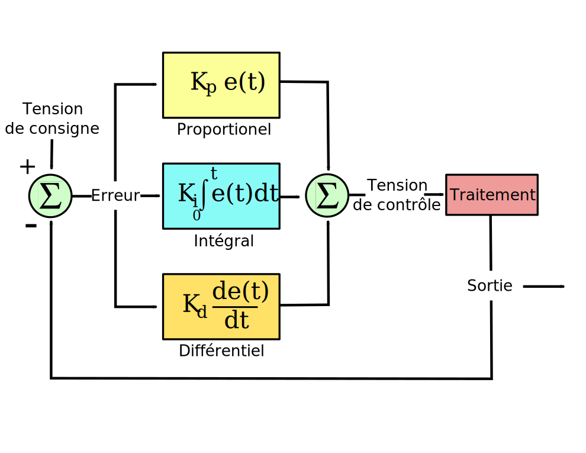
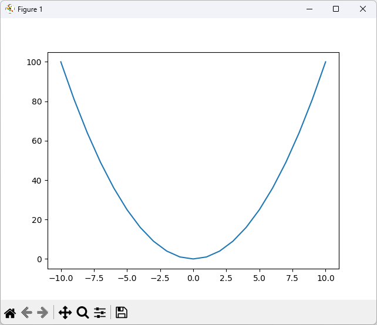
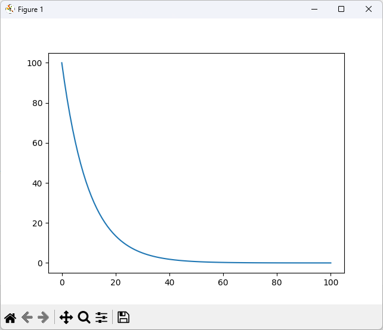
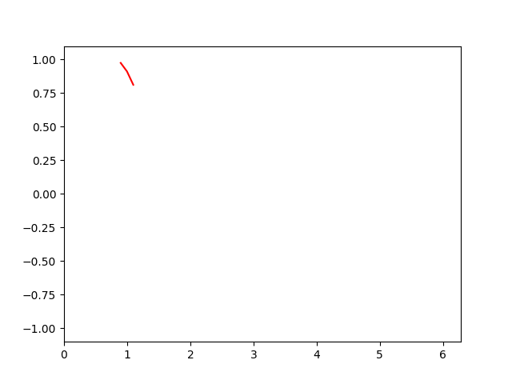
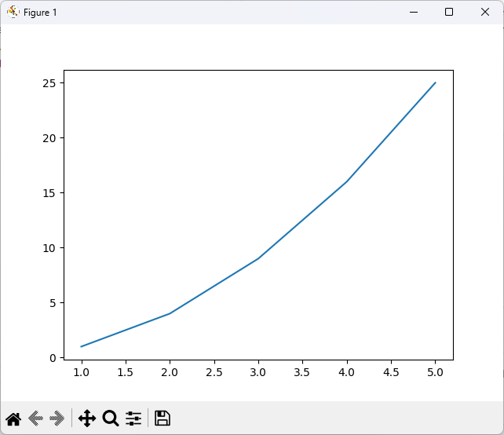
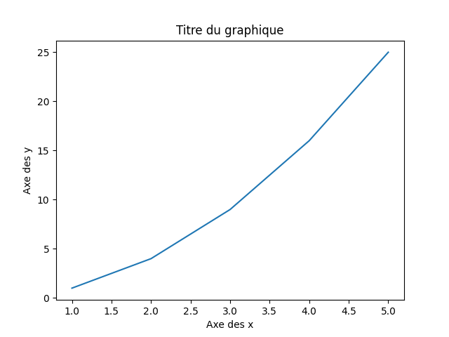
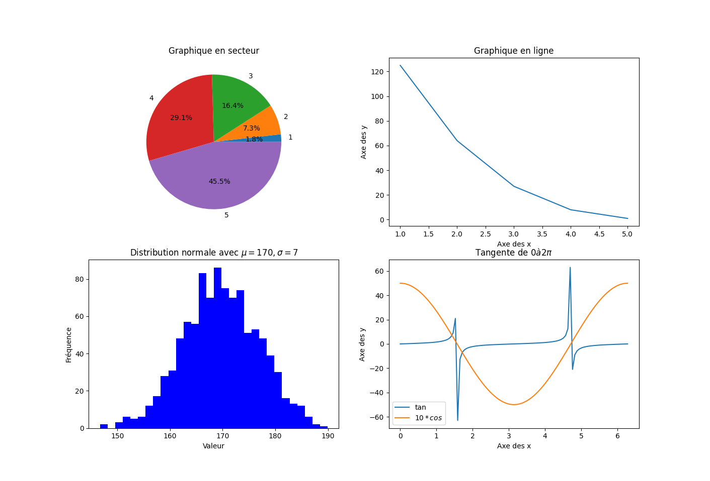
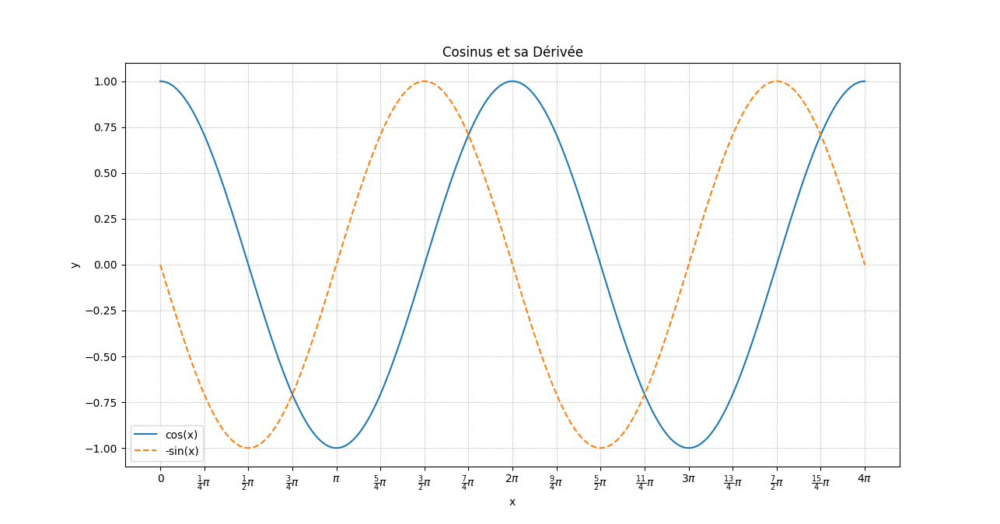

# Leçon 3 : Les boucles et les graphiques

TODO : Retirer les éléments d'une liste répondant à une condition

Dans cette leçon, nous allons apprendre à utiliser les boucles et réaliser des graphiques de base en Python.

## Les boucles



En programmation, il y a un concept qui s'appelle la répétition. Cela permet d'exécuter un bloc de code de manière répétée. 

On appelle cela une **boucle**. Généralement, on répétera une boucle tant qu'une condition spécifiée est vraie. Cela permet d'automatiser des tâches répétitives et est largement utilisé dans la programmation pour traiter des données, générer des motifs, et bien plus encore.

Imaginez que vous ayez une tâche à accomplir plusieurs fois, comme compter de 1 à 100 ou afficher un message plusieurs fois. Plutôt que de copier et coller le même code encore et encore, vous pouvez utiliser une boucle pour effectuer cette tâche de manière efficace.

En Python, il existe deux principales structures de boucles, à savoir les boucles `for` et `while`. Chacune de ces structures est utilisée pour répéter un bloc de code plusieurs fois, mais elles sont utilisées dans des contextes légèrement différents en fonction des besoins spécifiques du programme.

> **Note :** Pour les utilisateurs Excel, il n'y a pas de concept de boucle à proprement parler. Il faut utiliser un arrangement de plages de cellules pour simuler une boucle.


## Boucle `for`

La boucle `for` est utilisée pour itérer sur une séquence (qui peut être une liste, un tuple, un dictionnaire, un ensemble ou une chaîne). Elle est souvent utilisée quand nous savons à l'avance combien de fois nous voulons que le bloc de code soit exécuté.

> **Note :** Dans le paragraphe précédent, on mentionne les mots `liste`, `tuple`, `dictionnaire`, `ensemble` et `chaîne`. Ce sont des structures de données que nous verrons plus tard. Pour l'instant, vous pouvez les considérer comme des collections de données.

Exemple de base qui utilise une boucle `for`:

```python
for i in range(5):  # i prend les valeurs de 0 à 4
    print(i)
```

Vous pouvez également itérer directement sur les éléments d'une liste ou d'une autre collection:

```python
matieres = ["Chimie", "Physique", "Mathématiques", "Programmation", "Biologie"]
for matiere in matieres:
    print(matiere)
```

> ***Nouveauté :*** `range(a, b)` est une fonction qui retourne une séquence de nombres de `a` à `b` où **`b` est exclusif**. On peut la traduire la plage de nombre entre `a` et `b` exclusif.
> 
> On peut aussi utiliser `range(6)` pour avoir une séquence de nombres de 0 à 5 où le paramètre `a` est implicite et a la valeur 0 par défaut. Ainsi c'est l'équivalent de `range(0, 6)`.
> 
> Nous y reviendrons plus tard.

**Exemple**

Voici un exemple de boucle `for` qui permet de générer un graphique de la fonction $y = x^2$ :

```python
import matplotlib.pyplot as plt

# Création des listes vides
x = []
y = []

# Remplissage des listes
for i in range(-10, 11):
    x.append(i) 
    y.append(i**2)

# Affichage du graphique
plt.plot(x, y)
plt.show()
```

- On se rappelle que `append()` permet d'ajouter un élément à la fin d'une liste. (Voir le tableau [ici](#résumé-des-fonctions-utiles-pour-les-listes))
- Pour le `y`, on pourrait mettre une autre fonction pour représenter une autre courbe. Par exemple, on pourrait mettre `y.append(i**3)` pour représenter la fonction $y = x^3$.

<details><summary>Cliquer pour voir le résultat</summary>



</details>


---

## Boucle `while`

La boucle `while` est utilisée pour exécuter un bloc de code tant qu'une condition spécifiée est vraie. Elle vérifie la condition avant d'entrer dans la boucle à chaque itération.

Elle se traduit en français par "tant que".

Souvent on l'utilise pour exécuter un bloc de code un nombre de fois indéterminé. On peut aussi l'utiliser pour exécuter un bloc de code tant qu'une condition est vraie.

Voici quelques exemples de code utilisant une boucle `while` :

```python
# Fonction qui affiche la somme des nombres de a à b
def calculer_somme_entre_borne(limite_inf, limite_sup):
    
    # Validation pour éviter des erreurs
    if not (isinstance(limite_inf, int) and isinstance(limite_sup, int)):
        return "Erreur! Les deux limites doivent être de valeur entière."

    if limite_inf > limite_sup:
        return "Erreur! La limite inférieure doit être plus petite que la limite supérieure."
    
    i = limite_inf
    somme = 0

    while i <= limite_sup:
        somme += i # Équivaut à somme = somme + i
        i += 1

    return somme

lim_inf = 1
lim_sup = 5

print ("Afficher la somme des nombres de", lim_inf, "à", lim_sup)
print ("Somme =", calculer_somme_entre_borne(lim_inf, lim_sup))

```

> **Nouveauté!** <br />
> `isinstance()` est une fonction qui permet de vérifier le type d'une variable. Cette fonction retourne une valeur booléene.<br />
> 
> Les principaux types de données sont : 
> | Type | Description |
> | :--: | :---------- |
> | `int` | Nombre entier |
> | `float` | Nombre à virgule flottante |
> | `str` | Chaîne de caractères |
> | `bool` | Booléen |
> | `list` | Liste |
> | `tuple` | Tuple |
> | `dict` | Dictionnaire |
> | `set` | Ensemble |
> | `NoneType` | Valeur `None` |
>
   

---

Voici un autre exemple de boucle `while` qui permet de calculer la vitesse finale d'un objet :

```python
# Fonction qui affiche les vitesses finales en fonction de la vitesse initiale,
# de l'accélération et du temps

def calculer_vf(v0, a, tf):
    vt = v0
    increment = 1
    t = 0

    while t <= tf:
        vt = v0 + a * t
        print("t =", t, "s, v =", vt, "m/s")
        t += increment

print ("Calcul de la vitesse finale en fonction de la vitesse initiale, de l'accélération et du temps")
v0 = float(input("Entrez la vitesse initiale (m/s) : "))
a = float(input("Entrez l'accélération (m/s^2) : "))
t = float(input("Entrez la durée en seconde : "))

calculer_vf(v0, a, t)
```

> ***Nouveauté!*** <br/>
> La fonction `input()` permet de demander une entrée à l'utilisateur. Elle retourne une chaîne de caractères. On doit donc convertir la chaîne de caractères en nombre pour pouvoir faire des calculs avec.
> 

> ***Nouveauté!*** <br/>
> La fonction `float()` permet de convertir une chaîne de caractères en nombre à virgule flottante. Il existe aussi la fonction `int()` pour convertir une chaîne de caractères en nombre entier.

---

Voici un exemple de boucle qui ne s'arrête que si la seconde entrée est plus grande que la première :

```python
# Demander deux nombres à l'utilisateur
# et afficher le plus grand des deux

print ("Afficher le plus grand des deux nombres")

a = float(input("Entrez un nombre : "))
b = float(input("Entrez un autre nombre : "))

while a >= b:
    print("Le premier nombre doit être plus petit que le deuxième.")
    a = float(input("Entrez un nombre : "))
    b = float(input("Entrez un autre nombre : "))

```

---

Voici un autre exemple qui calcule la moyenne de notes entrées par l'utilisateur :

```python
# Calculer la moyenne de notes entrées par l'utilisateur
print ("Calculer la moyenne de notes entrées par l'utilisateur")

note = 0
somme = 0
nb_notes = 0

while note != -1:
    note = float(input("Entrez une note (-1 pour terminer) : "))
    if note != -1:
        somme += note
        nb_notes += 1

moyenne = somme / nb_notes

print("La moyenne est", moyenne)
```


Voici un autre exemple où l'on génère le graphique de la demi-vie d'un élément radioactif :

```python
# Fonction retournant la masse finale d'un échantillon en fonction
# de sa masse initiale, du temps et de la demi-vie
def calculer_decroissance_exponentielle(m0, t, demi_vie):
    return m0 * math.exp(-t / demi_vie)

# Variables
m0 = 100
demi_vie = 10
t = 0
pas = 1

# Création des listes
temps = []
masses = []

# Remplissage des listes
while t <= 100:
    temps.append(t)
    masses.append(calculer_decroissance_exponentielle(m0, t, demi_vie))
    t += pas

# Affichage du graphique
plt.plot(temps, masses)
plt.show()
```

**Note :** Si vous copiez le code de cet exemple, il y a aura des erreurs. Pourquoi?

<details><summary>Réponse ici et résultat</summary>

Réponse : Il manque les importations de bibliothèques. Il ne faut pas oublier d'importer `matplotlib.pyplot` et `math`.



</details>

## Sortir d'une boucle avec `break`
En plus de la condition de la boucle, on peut utiliser l'instruction `break` pour sortir d'une boucle. Cela peut être utile si on veut sortir d'une boucle avant que la condition ne soit fausse.

Voici un exemple :

```python
# Demander deux nombres à l'utilisateur
# et afficher le plus grand des deux
print ("Afficher le plus grand des deux nombres")
print("Entrez sur 'q' pour quitter.")

while True:

    a = input("Entrez un nombre : "))
    b = input("Entrez un autre nombre : "))

    if a == 'q' or b == 'q':
        break

    # Convertir les chaînes de caractères en nombre
    a = float (a)
    b = float (b)

    if a > b:
        print("Le premier nombre est plus grand.")
    elif a < b:
        print("Le deuxième nombre est plus grand.")
    else:
        print("Les deux nombres sont égaux.")
```

## Les graphiques avec `matplotlib`



 Nous avons vu quelques exemples dans les sections précédentes où nous avons utilisé `matplotlib` pour générer des graphiques. Dans cette section, nous allons apprendre à utiliser la librairie `matplotlib` pour générer des graphiques.

### Graphique simple
Voici un exemple de graphique simple :

```python
import matplotlib.pyplot as plt

# Création des listes
x = [1, 2, 3, 4, 5]
y = [1, 4, 9, 16, 25]

# Affichage du graphique
plt.plot(x, y)
plt.show()
```
---
Voici le résultat attendu



---

### Les titres
On peut ajouter des titres et des étiquettes aux axes du graphique avec les fonctions `title()`, `xlabel()` et `ylabel()`.

Voici un exemple :

```python
import matplotlib.pyplot as plt

# Création des listes
x = [1, 2, 3, 4, 5]
y = [1, 4, 9, 16, 25]

# Affichage du graphique
plt.plot(x, y)

# Ajout d'un titre
plt.title("Titre du graphique")

# Ajout d'étiquettes aux axes
plt.xlabel("Axe des x")
plt.ylabel("Axe des y")

plt.show()
```



---

### Échelle des axes

Avec la fonction `axis()`, on peut modifier l'échelle des axes. Par exemple, on peut mettre l'échelle de 0 à 6 pour l'axe des x et de 0 à 30 pour l'axe des y.

```python
import matplotlib.pyplot as plt

# Création des listes
x = [1, 2, 3, 4, 5]
y = [1, 4, 9, 16, 25]

# Affichage du graphique
plt.plot(x, y)

# Ajout d'un titre
plt.title("Titre du graphique")

# Ajout d'étiquettes aux axes
plt.xlabel("Axe des x")
plt.ylabel("Axe des y")

# Modification de l'échelle des axes
plt.axis([0, 6, 0, 30])

plt.show()
```

### Plusieurs séries et légende

Avec la fonction `legend()`, on peut ajouter une légende au graphique. Il faut spécifier les noms des courbes dans la fonction `plot()` et les noms des courbes dans la fonction `legend()`.

```python
import matplotlib.pyplot as plt

# Création des listes
x = [1, 2, 3, 4, 5]
y1 = [1, 4, 9, 16, 25]
y2 = [1, 8, 27, 64, 125] # 2e série de données

# Affichage du graphique
plt.plot(x, y1, label="y1")
plt.plot(x, y2, label="y2")

# Ajout d'un titre
plt.title("Titre du graphique")

# Ajout d'étiquettes aux axes
plt.xlabel("Axe des x")
plt.ylabel("Axe des y")

# Modification de l'échelle des axes
plt.axis([0, 6, 0, 30])

# Ajout de la légende
plt.legend()

plt.show()
```

### Autres types de graphiques
Évidemment, on peut réaliser plusieurs types de graphiques avec `matplotlib`. Voici quelques exemples :

**Graphique à barres**

```python
import matplotlib.pyplot as plt

# Création des listes
x = [1, 2, 3, 4, 5]
y = [1, 4, 9, 16, 25]

plt.bar(x, y)

plt.show()
```

**Graphique à barres horizontales**

```python
import matplotlib.pyplot as plt

# Création des listes
x = [1, 2, 3, 4, 5]
y = [1, 4, 9, 16, 25]

# Graphique à barres horizontales
plt.barh(x, y)

plt.show()
```

**Graphique à secteurs**

```python
import matplotlib.pyplot as plt

# Création des listes
x = [1, 2, 3, 4, 5]
y = [1, 4, 9, 16, 25]

# autopct='%1.1f%%' permet d'afficher le pourcentage et est optionnel
plt.pie(y, labels=x, autopct='%1.1f%%')

plt.show()
```

### Plusieurs graphiques avec `subplot()`
On peut afficher plusieurs graphiques dans une même fenêtre avec la fonction `subplot()`. Il faut spécifier le nombre de lignes, le nombre de colonnes et le numéro du graphique.

```python
mport matplotlib.pyplot as plt
import numpy as np

# Création des listes
x = [1, 2, 3, 4, 5]
y1 = [1, 4, 9, 16, 25]
y2 = [125, 64, 27, 8, 1]

# Créer un ensemble de valeurs x de 0 à 2*pi
x3 = np.linspace(0, 2 * np.pi, 100)
y3 = np.cos(x3) * 50
y4 = np.tan(x3)

# Configuration du graphique
# 2 ligne, 2 colonnes, graphique 1
plt.subplot(2, 2, 1)
plt.pie(y1, labels=x, autopct='%1.1f%%')
plt.title("Graphique en secteur")
plt.legend()

# 2 ligne, 2 colonnes, graphique 2
plt.subplot(2, 2, 2)
plt.plot(x, y2, label="y2")
plt.title("Graphique en ligne")
plt.xlabel("Axe des x")
plt.ylabel("Axe des y")

# Paramètres de la distribution normale
mean = 170
stddev = 7

# Générer des données aléatoires suivant cette distribution
data = np.random.normal(mean, stddev, 1000)

# 2 ligne, 2 colonnes, graphique 3
plt.subplot(2, 2, 3)

# Tracer l'histogramme
plt.hist(data, bins=30, color='blue')

plt.title("Distribution normale avec $\mu=170, \sigma=7$")
plt.xlabel("Valeur")
plt.ylabel("Fréquence")

# 2 ligne, 2 colonnes, graphique 3
plt.subplot(2, 2, 4)
plt.plot(x3, y4, label="tan")
plt.plot(x3, y3, label="$10*cos$")
plt.title("Tangente de $0 à 2\pi$")
plt.xlabel("Axe des x")
plt.ylabel("Axe des y")
plt.legend()

plt.show()
```

- On remarque que la configuration doit être séquentielle. On ne peut pas mettre le graphique 2 avant le graphique 1.
- On doit activer le bon graphique avec `plt.subplot(ligne, colonne, no_graph)` avant de faire les opérations sur le graphique.

**Questions**<br/>
1. Qu'est-ce qu'il y a de nouveau dans cet exemple?
2. Quel sera le résultat de cet exemple?
3. Qu'est-ce que la fonction `linspace()` fait?
4. Qu'est-ce que la fonction `np.random.normal()` fait?


<details><summary><b>Réponses</b></summary>

> 1. On utilise la fonction `subplot()` pour afficher plusieurs graphiques dans une même fenêtre et activer le graphique sur lequel on veut travailler.
> 2. On aura 4 graphiques dans une même fenêtre avec des propriétés différentes.
> 3. La fonction `linspace()` permet de générer un espace linéaire soit une séquence de nombres de 0 à 2$\pi$ avec 100 valeurs.
> 4. La fonction `np.random.normal()` permet de générer des nombres aléatoires suivant une distribution normale. On peut spécifier la moyenne, l'écart-type de la distribution et le nombre de valeurs à générer.



</details>

### Grillages
On peut ajouter des grillages avec la fonction `grid()`.

```python
import numpy as np
import matplotlib.pyplot as plt

# Créer un ensemble de valeurs x de 0 à 4*pi
x = np.linspace(0, 4 * np.pi, 500)

# Calculer les valeurs cosinus et -sinus de x
y_cos = np.cos(x)
y_sin_derivative = -np.sin(x)

# Tracer le cosinus
plt.plot(x, y_cos, label='cos(x)')

# Tracer sa dérivée
plt.plot(x, y_sin_derivative, label='-sin(x)', linestyle='--')

# Ajouter des légendes et des titres
plt.title("Cosinus et sa Dérivée")
plt.xlabel("x")
plt.ylabel("y")

# Ajouter le grillage
plt.xticks(np.arange(0, 4 * np.pi + 0.1, np.pi / 4), 
           ['0', r'$\frac{1}{4}\pi$', r'$\frac{1}{2}\pi$', r'$\frac{3}{4}\pi$',
            r'$\pi$', r'$\frac{5}{4}\pi$', r'$\frac{3}{2}\pi$', r'$\frac{7}{4}\pi$', 
            r'$2\pi$', r'$\frac{9}{4}\pi$', r'$\frac{5}{2}\pi$', r'$\frac{11}{4}\pi$', 
            r'$3\pi$', r'$\frac{13}{4}\pi$', r'$\frac{7}{2}\pi$', r'$\frac{15}{4}\pi$', 
            r'$4\pi$'])

# Version avec fonction
#xticks = np.arange(0, 4 * np.pi + 0.1, np.pi / 4)
#xtick_labels = [r"${{\frac{{{n}}}{{4}}\pi }}$" if n > 0 else "0" for n in range(len(xticks))]
#plt.xticks(xticks, xtick_labels)

plt.grid(color='gray', linestyle=':', linewidth=0.5)
plt.legend()

# Afficher le graphique
plt.show()

```



## Résumé de la leçon
Dans cette leçon, nous avons appris à utiliser les boucles `for` et `while` ainsi que la librairie `matplotlib` pour générer des graphiques. Par la bande, nous avons aussi appris à utiliser des fonctions de la librairie `numpy` pour générer des données.

Ces éléments adaptés à votre domaine vous permettront d'automatiser des tâches répétitives et de générer des graphiques pour visualiser des données.

Dans la prochaine leçon, nous allons voir comment utiliser des fichiers pour travailler avec des données. On verra comment charger un fichier et comment enregistrer des données dans un fichier.

De plus, j'aimerais que l'on explore l'utilisation de ChatGPT pour nous aider à faire du code.

## Leçon 3 : Exercices
1. À l'aide d'un problème de votre domaine, créer un programme qui permet de générer une ou plusieurs séries de données. Afficher le résultat des données dans la console.
2. Avec l'exercice précédent, tracer le graphique adapté pour les données générées.
3. Trouver un nouvel élément en lien avec cette leçon, mais que l'on n'a pas vu. Expliquer son fonctionnement et donner un exemple d'utilisation.

---

