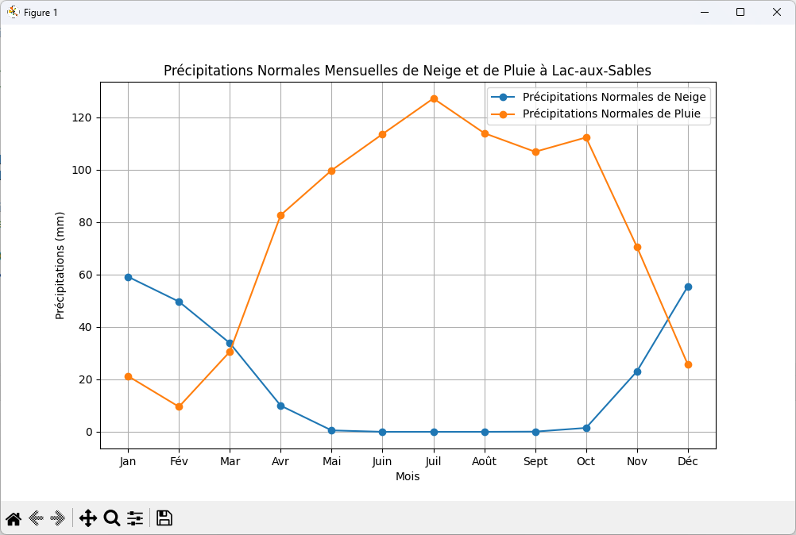

# Leçon 4 : Manipulation de données et s'autoformer avec l'intelligence artificielle <!-- omit in toc -->


# Table des matières <!-- omit in toc -->
- [Objectifs](#objectifs)
- [Lire des fichiers locaux](#lire-des-fichiers-locaux)
- [Lire un fichier texte](#lire-un-fichier-texte)
  - [Exercice](#exercice)
- [Lire un fichier CSV avec `pandas`](#lire-un-fichier-csv-avec-pandas)
  - [Utiliser `pandas` pour lire un fichier CSV](#utiliser-pandas-pour-lire-un-fichier-csv)
- [Le dataframe](#le-dataframe)
- [Fonctions courantes de `pandas`](#fonctions-courantes-de-pandas)
- [Exemple - Afficher la courbe des précipitations](#exemple---afficher-la-courbe-des-précipitations)
  - [Résultat](#résultat)
- [Leçon bonus : ChatGPT](#leçon-bonus--chatgpt)
  - [Créer un compte et se connecter à ChatGPT](#créer-un-compte-et-se-connecter-à-chatgpt)
  - [Utiliser ChatGPT pour écrire du code](#utiliser-chatgpt-pour-écrire-du-code)
  - [Itération](#itération)
  - [Expliquer le code](#expliquer-le-code)
- [Exercice : Analyse de données avec ChatGPT](#exercice--analyse-de-données-avec-chatgpt)
  - [Énoncé](#énoncé)
- [Références](#références)


# Objectifs
- Apprendre à lire des fichiers locaux en utilisant Python.
- Afficher des données de manière à faciliter leur copie vers Excel.
- Enregistrer des données dans des fichiers au format CSV et Excel.
- Afficher des graphiques pour visualiser des données.
- Utiliser un outils d'intelligence artificielle pour s'autoformer.

# Lire des fichiers locaux
Savoir lire dans un fichier est une compétence fondamentale en programmation. Cela permet de lire des données et de les manipuler dans un programme.

Voici quelques raisons pour lesquelles il est important de savoir lire des fichiers :

- **Accès aux Données** : Essentiel pour exploiter les données nécessaires aux analyses.
- **Automatisation** : Permet le traitement automatisé de grandes quantités de données.
- **Interdisciplinarité** : Facilite la collaboration et l'utilisation de données entre différents domaines.
- **Reproductibilité** : Contribue à la reproductibilité des recherches en permettant la vérification des résultats.
- **Adaptabilité** : Rend capable de gérer divers types de données et formats de fichiers.
- **Exploitation des Ressources** : Ouvre l'accès à une vaste quantité de ressources éducatives et scientifiques.
- **Économie de Ressources** : Économise le temps et les efforts, permettant de se concentrer sur l'analyse et l'innovation.

# Lire un fichier texte
Pour lire un fichier texte, on utilise la fonction `open()` avec le mode `r` pour lire. On peut ensuite utiliser la méthode `read()` pour lire le contenu du fichier.

Voici un exemple permettant de lire de contenu d'un fichier texte :

```python
# Déclarer le chemin vers le fichier
nom_fichier = "fichier.txt"

# Initialiser le contenu
contenu = ""

# Ouvrir le fichier en mode lecture
with open(nom_fichier, "r") as fichier:
    contenu = fichier.read()

# Afficher le contenu
print(contenu)
```

---

Remarquez dans l'exemple précédent que l'on utilise le mot-clé `with`. Cela permet de s'assurer que le fichier est fermé après avoir été utilisé. C'est une bonne pratique en programmation de fermer les fichiers après les avoir utilisés.

En français, on pourrait lire le code comme suit : *"Avec le fichier `nom_fichier` ouvert en mode lecture, lire le contenu du fichier et l'assigner à la variable `contenu`."*


> **Note** : Le chemin vers le fichier peut être absolu ou relatif. Un chemin absolu est le chemin complet vers le fichier. Un chemin relatif est le chemin par rapport à l'emplacement du script Python.
> 
> Il est possible d'utilise ce format de chemin pour Windows : `c:/dossier/fichier.txt`. Il est plus facile que le format standard `c:\\dossier\\fichier.txt`.

---

Nous avons utilisé la méthode `read()` pour lire le contenu du fichier. Il existe d'autres méthodes pour lire le contenu d'un fichier. Par exemple, on peut utiliser la méthode `readline()` pour lire une ligne à la fois.

Voici un exemple :

```python
# Déclarer le nom du fichier
nom_fichier = "fichier.txt"

# Ouvrir le fichier en mode lecture
with open(nom_fichier, "r") as fichier:
    # Lire la première ligne
    ligne = fichier.readline()
    print(ligne)

    # Lire la deuxième ligne
    ligne = fichier.readline()
    print(ligne)
```

L'utilisation de `readline()` est utile pour lire un fichier ligne par ligne et ensuite traiter chaque ligne séparément.

## Exercice
Dans cet exercice, nous allons télécharger un fichier CSV à partir du sites www.donneesquebec.ca. Ce fichier continer les normales climatiques mensuelles pour la période de 1991 à 2020.

1. Téléchargez le fichier CSV à partir du lien suivant : [Normales climatiques mensuelles](https://www.donneesquebec.ca/recherche/dataset/normales-climatiques-mensuelles/resource/fae9769d-ef7d-4e7f-805f-079ee29cf292).
2. Déplacez le fichier dans le même répertoire que votre script Python.
   1. De mémoire le nom du fichier est `normales-mens-1991-2020.csv`.
3. Modifiez le script Python pour lire le contenu du fichier CSV.
4. Exécutez le script et observez l'information qui s'affiche.

> **Point d'intérêt** : Le sites www.donneesquebec.ca est une plateforme qui permet de découvrir, d'accéder et de télécharger des données ouvertes de différentes instances publiques et para-publiques du Québec. Ces données sont mises à disposition pour être réutilisées et partagées par la communauté.


---

# Lire un fichier CSV avec `pandas`
Dans l'exercice précédent, vous avez téléchargé un fichier en format CSV. Un fichier CSV (*Comma-Separated Values*) est un fichier texte qui contient des données séparées par des séparateurs qui sont généralement des virgule, des points-virgules ou des tabulations. C'est un format de fichier couramment utilisé pour stocker des données tabulaires.

On utilise souvent ce format pour stocker des données provenant de bases de données ou pour échanger des données entre différentes applications.

Le format ressemble un peu à un tableau Excel. Chaque ligne du fichier correspond à une ligne du tableau et chaque valeur est séparée par un séparateur.

D'ailleurs, Excel peut ouvrir des fichiers CSV.

Voici un exemple de contenu CSV :

```csv
Nom,Prénom,Âge
Tremblay,Marie,25
Lavoie,Éric,32
Gagnon,Stéphanie,28
```

Dans plusieurs cas, la première ligne du fichier CSV contient les noms des colonnes. Cela permet de savoir ce que chaque colonne représente.

Pour lire un fichier CSV, on peut utiliser la librairie `pandas`. C'est une librairie très populaire pour manipuler des données en Python.

## Utiliser `pandas` pour lire un fichier CSV
Voici un exemple pour lire un fichier CSV avec `pandas` :

```python
# Importer la librairie pandas et lui donner l'alias pd
import pandas as pd

# Lire le fichier CSV
df = pd.read_csv("normales-mens-1991-2020.csv")

# Afficher un résumé des 5 premières lignes
print(df.head())
```

Voici la sortie de l'exemple :

```
  NO_STATION  ... TMOY_NORMALE_NB_ANNEES
0    7010453  ...                   25.0
1    7010453  ...                   25.0
2    7010453  ...                   24.0
3    7010453  ...                   25.0
4    7010453  ...                   26.0

[5 rows x 34 columns]
```

On voit que `pandas` a lu le fichier et affiché un résumé des 5 premières lignes de ce fichier.

Si l'on désire afficher un peu plus de colonnes, on peut configurer `pandas` pour afficher plus de colonnes :

```python
# Configurer pandas pour afficher plus de colonnes
pd.set_option('display.max_columns', 5)
```

> **Note** : Dans l'importation de `pandas`, on lui a donné l'alias `pd`. C'est une convention très courante en Python. Cela permet de raccourcir le nom de la librairie pour l'utiliser plus facilement.

---
# Le dataframe
On remarque que l'on travaille avec une variable nommée `df`. C'est une variable de type `DataFrame` de `pandas`.

Le `DataFrame` pandas est une structure qui contient des données bidimensionnelles et leurs étiquettes correspondantes. Les `DataFrames` sont largement utilisés dans la science des données, l'apprentissage automatique, le calcul scientifique et de nombreux autres domaines intensifs en données. Les `DataFrames` sont similaires aux feuilles de calcul avec lesquelles vous travaillez dans Excel.

# Fonctions courantes de `pandas`
`pandas` offre plusieurs fonctions pour manipuler des données de `DataFrame`. Voici quelques exemples :

| Fonction | Description |
| --- | --- |
| `df.head()` | Affiche les 5 premières lignes du tableau. |
| `df.tail()` | Affiche les 5 dernières lignes du tableau. |
| `df.info()` | Affiche des informations sur le tableau. |
| `df.describe()` | Affiche des statistiques sur le tableau. |
| `df.shape` | Retourne le nombre de lignes et de colonnes du tableau. |
| `df.columns` | Retourne les noms des colonnes du tableau. |
| `df['Nom de la colonne']` | Retourne une colonne du tableau. |

---
Voici ce que retourne `df.info()` du fichier CSV que vous avez téléchargé dans l'exercice précédent :

```
<class 'pandas.core.frame.DataFrame'>
RangeIndex: 3012 entries, 0 to 3011
Data columns (total 34 columns):
 #   Column                    Non-Null Count  Dtype  
---  ------                    --------------  -----  
 0   NO_STATION                3012 non-null   object 
 1   NOM_STATION               3012 non-null   object 
 2   DATE_OUVERTURE            3012 non-null   object 
 3   DATE_FERMETURE            624 non-null    object 
 4   LONGITUDE                 3012 non-null   float64
 5   LATITUDE                  3012 non-null   float64
 6   ALTITUDE                  3012 non-null   int64  
 7   TYPE_STATION              3012 non-null   object 
 8   PERIODE                   3012 non-null   object 
 9   MOIS                      3012 non-null   int64  
 10  NEIGE_NORMALE             2832 non-null   float64
 11  NEIGE_NORMALE_CS          2832 non-null   float64
 12  NEIGE_NORMALE_ECART_TYPE  2832 non-null   float64
 13  NEIGE_NORMALE_NB_ANNEES   2832 non-null   float64
 14  PLUIE_NORMALE             2808 non-null   float64
 15  PLUIE_NORMALE_CS          2808 non-null   float64
 16  PLUIE_NORMALE_ECART_TYPE  2808 non-null   float64
 17  PLUIE_NORMALE_NB_ANNEES   2808 non-null   float64
 18  PREC_NORMALE              2720 non-null   float64
 19  PREC_NORMALE_CS           2720 non-null   float64
 20  PREC_NORMALE_ECART_TYPE   2720 non-null   float64
 21  PREC_NORMALE_NB_ANNEES    2720 non-null   float64
 22  TMAX_NORMALE              2919 non-null   float64
 23  TMAX_NORMALE_CS           2919 non-null   float64
 24  TMAX_NORMALE_ECART_TYPE   2919 non-null   float64
 25  TMAX_NORMALE_NB_ANNEES    2919 non-null   float64
 26  TMIN_NORMALE              2921 non-null   float64
 27  TMIN_NORMALE_CS           2921 non-null   float64
 28  TMIN_NORMALE_ECART_TYPE   2921 non-null   float64
 29  TMIN_NORMALE_NB_ANNEES    2921 non-null   float64
 30  TMOY_NORMALE              2911 non-null   float64
 31  TMOY_NORMALE_CS           2911 non-null   float64
 32  TMOY_NORMALE_ECART_TYPE   2911 non-null   float64
 33  TMOY_NORMALE_NB_ANNEES    2911 non-null   float64
dtypes: float64(26), int64(2), object(6)
memory usage: 800.2+ KB
```

> **Note** : De façon générale, les fichiers de Données Québec ont une fiche descriptive qui explique les données contenues dans le fichier. Cela permet de comprendre les données et de les utiliser correctement.
> 
> Dans le cas présent, voici la [page de la fiche descriptive](https://www.donneesquebec.ca/recherche/dataset/normales-climatiques-mensuelles).

# Exemple - Afficher la courbe des précipitations

Dans cet exemple, nous allons afficher un graphique des précipitations normales mensuelles de neige et de pluie à la station météorologique de Lac-aux-Sables.

```python
import pandas as pd
import matplotlib.pyplot as plt
from scipy import stats

# Utiliser le chemin de fichier fourni
filename = 'normales-mens-1991-2020.csv'

# Charger les données
df = pd.read_csv(filename)

# Filtre pour le dataframe
filtre = df['NOM_STATION'] == "Lac-aux-Sables"

# Création d'une variable avec des données filtrées
df_muni = df[filtre]

# Extraire les données nécessaires
mois = df_muni["MOIS"]
neige_normale = df_muni["NEIGE_NORMALE"]
pluie_normale = df_muni["PLUIE_NORMALE"]


# Créer le graphique
plt.figure(figsize=(10,6))
plt.plot(mois, neige_normale, label='Précipitations Normales de Neige', marker='o')
plt.plot(mois, pluie_normale, label='Précipitations Normales de Pluie', marker='o')

# Ajouter des titres et des étiquettes
plt.title('Précipitations Normales Mensuelles de Neige et de Pluie à Lac-aux-Sables')
plt.xlabel('Mois')
plt.ylabel('Précipitations (mm)')
plt.xticks(mois, ['Jan', 'Fév', 'Mar', 'Avr', 'Mai', 'Juin', 'Juil', 'Août', 'Sept', 'Oct', 'Nov', 'Déc'])
plt.legend()
plt.grid(True)

# Afficher le graphique
plt.show()
```

## Résultat

Si tout se passe bien, vous devriez voir un graphique qui affiche les précipitations normales mensuelles de neige et de pluie à la station météorologique de Lac-aux-Sables qui ressemble à ceci :



---

# Leçon bonus : ChatGPT
Dans cette leçon bonus, nous allons accélérez votre apprentissage en utilisant ChatGPT pour faire du code de base et s'autoformer. En effet, ChatGPT est un modèle de langage génératif qui peut vous aider à écrire du code et à s'autoformer.

C'est un bon adjoint pour vous aider à programmer, à résoudre des problèmes et à apprendre de nouvelles compétences.

Pour utiliser ChatGPT, vous pouvez utiliser le site [ChatGPT](https://chat.openai.com/).

> **Mise en garde** : ChatGPT est un modèle de langage génératif qui peut générer du code. Cependant, il est loin d'être parfait et génère parfois  du code incorrect. Il est important de toujours vérifier le code généré et de le tester avant de l'utiliser dans un projet.

## Créer un compte et se connecter à ChatGPT
1. Ouvrez le site [ChatGPT](https://chat.openai.com/).
2. Créez-vous un compte ou connectez-vous.
3. Une fois que vous êtes connecté, vous pouvez poser des questions ou demander de l'aide pour écrire du code.

Voici ce à quoi ressemble la page de ChatGPT :


## Utiliser ChatGPT pour écrire du code
Pour utiliser ChatGPT pour écrire du code, vous pouvez poser des questions ou demander de l'aide pour écrire du code.

Cependant, il est préférable de lui faire une mise en contexte pour qu'il puisse vous aider efficacement.

Voici un exemple de mise en contexte pour ChatGPT :

```text
Je suis enseignant de cégep en chimie. Je ne suis pas à l'aise avec Python et j'aimerais l'apprendre dans le contexte de mes cours.
```
Voici la réponse qu'il m'a donnée :


---

Un astuce pour bien utiliser ChatGPT est de lui décrire le problème et les requis que vous avez. Cela lui permet de vous donner une réponse plus précise.

Voici un exemple de question que vous pourriez lui poser :

```text
Je voudrais créer un petit programme qui calcule la concentration molaire d'une solution. Voici la formule : C = n / V.

Le programme devra demander à l'utilisateur de saisir le nombre de moles et le volume de la solution. Ensuite, il devra afficher la concentration molaire.
```

Voici la réponse qu'il m'a donnée :

```python
def calculer_concentration_molaire():
    # Demander à l'utilisateur de saisir le nombre de moles
    nombre_de_moles = float(input("Entrez le nombre de moles de soluté : "))

    # Demander à l'utilisateur de saisir le volume de la solution en litres
    volume_solution = float(input("Entrez le volume de la solution en litres : "))

    # Calculer la concentration molaire en utilisant la formule C = n / V
    concentration_molaire = nombre_de_moles / volume_solution

    # Afficher la concentration molaire
    print("La concentration molaire de la solution est de {:.2f} mol/L.".format(concentration_molaire))

# Appeler la fonction pour exécuter le programme
calculer_concentration_molaire()
```

## Itération
Si vous n'êtes pas satisfait de la réponse, vous pouvez demander à ChatGPT de vous donner une autre réponse. Vous pouvez itérer en posant des questions plus précises ou en lui donnant plus de contexte.

Par exemple, j'aimerais que le calcul soit dans une fonction qui reçoit les deux paramètres soit `nombre_de_moles` et `volume_solution`.

```text
Pourrais-tu modifier le code pour que le calcul de la concentration molaire soit dans une fonction qui reçoit les deux paramètres soit `nombre_de_moles` et `volume_solution`?
```

Voici la réponse qu'il m'a donnée :

```python
def calculer_concentration_molaire(nombre_de_moles, volume_solution):
    # Calculer la concentration molaire en utilisant la formule C = n / V
    concentration_molaire = nombre_de_moles / volume_solution
    return concentration_molaire

def main():
    # Demander à l'utilisateur de saisir le nombre de moles
    nombre_de_moles = float(input("Entrez le nombre de moles de soluté : "))

    # Demander à l'utilisateur de saisir le volume de la solution en litres
    volume_solution = float(input("Entrez le volume de la solution en litres : "))

    # Appeler la fonction pour calculer la concentration molaire
    concentration_molaire = calculer_concentration_molaire(nombre_de_moles, volume_solution)

    # Afficher la concentration molaire
    print("La concentration molaire de la solution est de {:.2f} mol/L.".format(concentration_molaire))

# Appeler la fonction main pour exécuter le programme
if __name__ == "__main__":
    main()
```

## Expliquer le code
Parfois, il va générer du code dont une partie n'est pas claire. Vous pouvez lui demander d'expliquer le code pour mieux le comprendre.

```text
À quoi sert la partie `if __name__ == "__main__":` dans le code que tu as généré?
```

De façon générale, ChatGPT sera en mesure de vous expliquer le code qu'il a généré.

# Exercice : Analyse de données avec ChatGPT

Voici le début d'un exercice pour analyser des données avec ChatGPT.

```text
J'utilise le fichier "Normales climatiques mensuelles" de données Québec. J'aimerais utilisé pandas pour faire de l'analyse de données. Peux-tu me faire le début du script pour pouvoir charger les données?
```

ChatGPT vous donnera une réponse qui ressemblera à ceci :

```python
import pandas as pd

# Chemin vers le fichier CSV contenant les données des normales climatiques mensuelles de Québec
chemin_fichier = "chemin/vers/votre/fichier.csv"

# Charger les données à partir du fichier CSV en utilisant Pandas
donnees_climatiques = pd.read_csv(chemin_fichier)

# Afficher les premières lignes du DataFrame pour s'assurer que les données ont été chargées correctement
print(donnees_climatiques.head())
```

---

Voici ma question suivante :

```text
La sortie de donnees_climatiques.info() est la suivante : 

---> J'ai collé le contenu de la sortie de la commande info() ici. <--
```

Cette action permet à ChatGPT de comprendre le contexte et de vous donner des réponses plus précises.

---

## Énoncé

Vous devez demander à ChatGPT de vous aider à charger les données et de  générer un graphique qui contient les précipitations normales mensuelles de neige, de pluie ainsi que la température moyenne à la station météorologique au choix de l'utilisateur si la station n'est pas disponible, afficher un message d'erreur.


---

# Références
- [Introducing the pandas DataFrame](https://realpython.com/pandas-dataframe/)