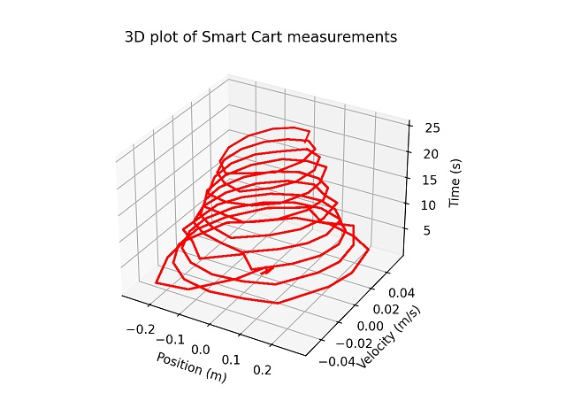
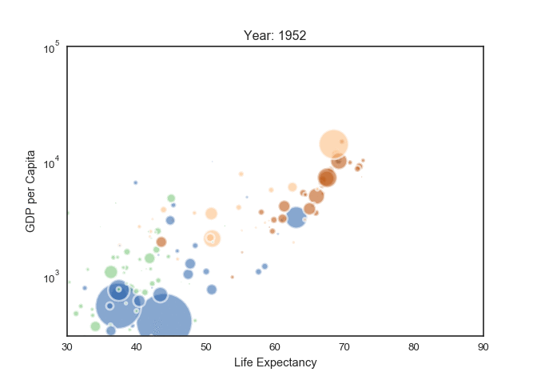
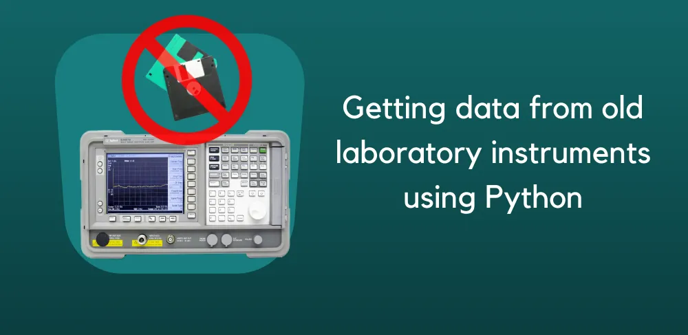

# Cours express sur la programmation <!-- omit in toc -->

# Table des matières <!-- omit in toc -->

- [Introduction](#introduction)
- [Que peut-on faire avec Python?](#que-peut-on-faire-avec-python)
- [Les plans de leçons](#les-plans-de-leçons)
  - [Plan de leçon 1 : Introduction à la programmation et fonctions de base](#plan-de-leçon-1--introduction-à-la-programmation-et-fonctions-de-base)
    - [Lien leçon 1](#lien-leçon-1)
  - [Plan de leçon 2 : Contrôle de flux et les listes](#plan-de-leçon-2--contrôle-de-flux-et-les-listes)
    - [Lien leçon 2](#lien-leçon-2)
  - [Plan de leçon 3 : Les boucles, fonctions avancées et visualisation avec Matplotlib](#plan-de-leçon-3--les-boucles-fonctions-avancées-et-visualisation-avec-matplotlib)
    - [Lien leçon 3](#lien-leçon-3)
  - [Plan de leçon 4 : Manipulation de données](#plan-de-leçon-4--manipulation-de-données)
- [Références](#références)

# Introduction

Cet article se veut comme un cours rapide sur les bases de la programmation pour pouvoir créer des outils. Il est destiné à des personnes qui ont déjà une base en science et qui veulent utiliser la programmation pour faire des analyses de données, des calculs, des graphiques, etc. Il est aussi destiné à des personnes qui ont déjà une base en programmation mais qui veulent apprendre à utiliser Python. On prend aussi pour acquis que le lecteur connaît l'utilité de la programmation.

Ce cours est basé sur le langage Python. Il existe plusieurs langages de programmation, mais Python est un langage très populaire et très utilisé dans le monde de la science. Il est aussi très facile à apprendre et à utiliser. Il est donc un bon choix pour commencer à apprendre la programmation.

On séparera ce cours en trois leçons d'une heure. La première leçon se consacrera sur la programmation de base, la deuxième sur le contrôle de flux et boucles et la troisième sur les fonctions, les modules et l'affichage de graphiques.

# Que peut-on faire avec Python?

Voici des exemples d'outils créés avec Python ou encore des possibilités.

# Les plans de leçons

## Plan de leçon 1 : Introduction à la programmation et fonctions de base

Durée : 1 heure

-   Introduction à la programmation et à Thonny.
-   Concepts fondamentaux de la programmation : variables, types de données, opérations mathématiques.
-   Écriture de programmes simples pour effectuer des calculs.
-   Introduction aux fonctions : définition, paramètres, valeurs de retour.
-   Exercices pratiques pour créer et appeler des fonctions simples.

### [Lien leçon 1](lecon_01.md)

## Plan de leçon 2 : Contrôle de flux et les listes

Durée : 1 heure

-   Révision des concepts abordés dans la première séance.
-   Structures de contrôle de flux : if, else, elif.
-   Les listes
-   Exercices pratiques pour créer des programmes avec des structures de contrôle et des listes
-   Introduction à l'utilisation de Thonny pour déboguer les erreurs.

### [Lien leçon 2](lecon_02.md)

## Plan de leçon 3 : Les boucles, fonctions avancées et visualisation avec Matplotlib

Durée : 1 heure

-   Révision des concepts abordés dans les séances précédentes.
-   Les boucles : while et for.
-   Fonctions avec des valeurs de retour et utilisation avancée de fonctions.
-   Introduction à la bibliothèque Matplotlib pour la visualisation de données.
-   Création de graphiques simples avec Matplotlib.
-   Exercices pratiques pour créer des programmes plus complexes avec des fonctions et générer des graphiques.

Chaque séance d'une heure se concentre sur des concepts spécifiques et propose des exercices pratiques pour renforcer les compétences acquises. Les plans seront adaptés en fonction du niveau de familiarité des enseignants avec la programmation.

### [Lien leçon 3](lecon_03.md)

## Plan de leçon 4 : Manipulation de données

TODO : Compléter le plan de leçon 4

---

# Références
- [W3Schools](https://www.w3schools.com/python/)
  - Très bon site pour apprendre un langage de programmation
- [Python Graph Gallery](https://python-graph-gallery.com/)
  - Exemple de graphiques avec le code pour les générer
- [PASCO Python Examples](https://github.com/PASCOscientific/pasco_python_examples)
  - Exemple d'utilisation de Python avec les appareils PASCO
- [Automate the Boring Stuff with Python](https://automatetheboringstuff.com/#toc)
  - Livre gratuit sur Python pour simplifier les tâches répétitives
- [Print lists in Python using 4 differents](https://www.geeksforgeeks.org/print-lists-in-python-4-different-ways/)
