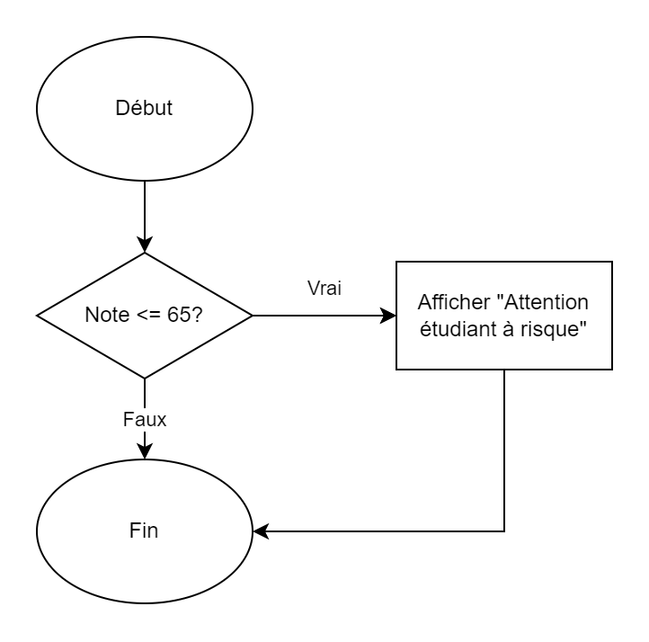
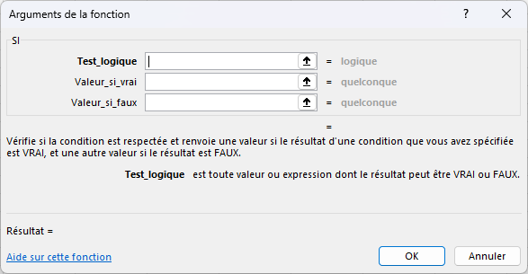

# Leçon 2 : Contrôle de flux et les listes

**Durée : 1 heure**

## Objectifs

-   Réviser les concepts abordés dans la première séance.
-   Apprendre à utiliser les structures de contrôle de flux.
-   Apprendre à utiliser la valeur `None`
-   Apprendre à utiliser les listes
-   Apprendre à utiliser Thonny pour déboguer les erreurs.
-   Créer des programmes en utilisant des listes et des structures de contrôle de flux.
## Contenu

1.  **Bref retour sur les concepts abordés dans la première séance**
    -   Variables et types de données (entiers, flottants, chaînes de caractères).
    -   Opérations mathématiques en Python.
    -   Définition de fonctions en Python.
2.  **Structures de contrôle de flux**
3.  **La valeur `None`**
4.  **Les listes**
5.  **Exercices pratiques**
    -   Création de programmes avec des structures de contrôle et des boucles.
    -   Utilisation de Thonny pour déboguer les erreurs.

## Révision des concepts abordés dans la première séance

Voici quelques questions pour réviser les concepts abordés dans la première séance :

1.  Qu'est-ce qu'une variable?
2.  Qu'est-ce que l'assignation?
3.  Qu'est-ce qu'une expression?
4.  Qu'est-ce qu'une fonction?
5.  Qu'est-ce que l'indentation?
6.  Quelles sont les règles générales de nomenclatures en Python?
7.  Quelles fonctions avez-vous créées dans votre devoir?

## Structures de contrôle de flux

Les structures de contrôle de flux permettent de contrôler l'exécution du code. Elles permettent de faire des choix selon des conditions. Elles permettent aussi de répéter des instructions.

En français, on utilise les mots `si`, `sinon` et `sinon si` pour faire des choix. En programmation, on utilise les mots `if`, `else` et `elif` (*contraction de else if*).

On utilise parfois un diagramme à flux de données pour représenter les structures de contrôle de flux. Voici un exemple :



> **Comparaison avec Excel** <br />
> Si vous avez déjà utilisé Excel, vous avez probablement utilisé les fonctions `SI` et `SOMME.SI`. Ces fonctions sont des structures de contrôle de flux. Elles permettent de faire des choix selon des conditions.

Voici la **structure générale** de contrôle de flux en Python:

```py
if condition 1:
    # Instructions si condition 1 vrai

# Optionnel
elif condition N: 
    # Instructions si condition N vrai

# Optionnel
else: 
    # Instructions si toutes les conditions sont fausses
```

> **Comparaison Excel** <br />
> `=si(condition; valeur_si_vrai; valeur_si_faux)`<br />
> <br />

**Seul le `if` est obligatoire**. On peut avoir plusieurs `elif` et un seul `else`. On peut aussi avoir seulement un `if` et un `else`.

> **Note :** Remarquez qu'après la condition, il y a un "`:`". On note aussi que les instructions suivant la condition sont indentées. C'est une syntaxe spécifique à Python.
> 
> Le nombre d'espaces standard est de 4 ([Src : PEP 8](https://peps.python.org/pep-0008/#indentation)). Il est aussi possible de mettre des tabulations. Cependant, il faut être cohérent. Il est proscrit de mélanger les espaces et les tabulations.


Voici un exemple que vous pouvez tester:

```py
# Variables
age = 18

# Structure de contrôle de flux
if age < 5:
    print("Gratuit")
elif age < 12:
    print("Tarif enfant")
elif age < 65:
    print("Tarif adulte")
else:
    print("Tarif aîné")
```

Dans un `if`, il y a une condition. La condition est une expression booléenne. Une expression booléenne est une expression qui retourne `True` ou `False`. Si la condition est `True`, les instructions dans le `if` sont exécutées. Si la condition est `False`, les instructions dans le `if` sont ignorées.

Voici un autre exemple :

```py
# Variables
age = 18

if (age >= 18):
    print("Vous êtes un adulte")
else:
    print("Vous êtes un mineur")
```

Voici le code qui représente le diagramme de flux montré plus haut :

```py
# Variables
note = 70

if note <= 65:
    print ("Attention, risque d'échec!")

```

On peut mettre des structures conditionnelles à l'intérieur des fonctions.

Voici un exemple :

```py
# Fonction indiquant si le pH est acide, neutre ou basique
def type_pH(pH):
    if pH < 7:
        print("Acide")
    elif pH > 7:
        print("Basique")
    else:
        print("Neutre")

# Appel de la fonction
type_pH(7.5)
```

> **Note :** On remarque toujours l'indentation dans les structures de contrôle de flux. Cela facilite la lecture en bloc. On rappel que l'indentation est obligatoire en Python.

### Opérateurs de comparaison

Les expressions conditionnelles utilisent des opérateurs de comparaison. Voici un tableau des opérateurs de comparaison de base :

| Opérateur | Description          | Exemple   |
| :-------: | :------------------- | :-------- |
|    `==`   | Égalité              | `a == b`  |
|    `!=`   | Différence           | `a != b`  |
|    `>`    | Plus grand que       | `a > b`   |
|    `<`    | Plus petit que       | `a < b`   |
|    `>=`   | Plus grand ou égal à | `a >= b`  |
|    `<=`   | Plus petit ou égal à | `a <= b`  |
|   `not`   | Négation             | `not a`   |
|   `and`   | ET logique           | `a and b` |
|    `or`   | OU logique           | `a or b`  |

Dans tous les cas, l'expression retourne `True` ou `False`. `a` ou `b` peuvent être des variables ou des expressions.

Voici un exemple :

```py
# Variables
age = 18
ami = True

# Structure de contrôle de flux
if age >= 18 and ami:
    print("On va au Trou du Diable!")
else:
    print("On va dans ton sous-sol!")
```

> **Attention erreur fréquente!** <br />
> Dans les expressions conditionnelles, on utilise `==` pour vérifier l'égalité. On utilise `=` pour assigner une valeur à une variable. <br />
> Si votre code ne fonctionne pas, vérifiez que vous n'avez pas utilisé `=` au lieu de `==`.

#### Table de vérité 
Voici un petit rappel de la table de vérité pour les opérateurs logiques `and` et `or` :

| `a`  | `b`  | `a and b` | `a or b` |
| :--: | :--: | :-------: | :------: |
| `T`  | `T`  |    `T`    |   `T`    |
| `T`  | `F`  |    `F`    |   `T`    |
| `F`  | `T`  |    `F`    |   `T`    |
| `F`  | `F`  |    `F`    |   `F`    |

En résumé pour le `ET`, il faut que les deux conditions soient vrai pour que l'expression soit vrai. Pour le `OU`, il faut qu'au moins une des conditions soit vrai pour que l'expression soit vrai.

### Autres exemples

Voici une liste d'exemples où l'on pourrait devoir utiliser des structures de contrôle de flux avec conditions multiples :
- **Science générale :** Trouver la bonne formule à appliquer selon les données d'entrée, i.e. quelle est l'inconnue.
- **Géométrie :** Déterminer s'il y a collision entre deux rectangles.
- **Administration :** Déterminer si un étudiant est admissible à un programme.

## La valeur **`None`**

En Python, il y a une valeur spéciale qui est `None`. Cette valeur est utilisée pour indiquer qu'une variable n'a pas de valeur. On peut l'utiliser pour initialiser une variable. On peut aussi l'utiliser pour indiquer qu'une fonction ne retourne pas de valeur.

Elle peut être utilisé pour initialiser une variable que l'on va utiliser plus tard. Par exemple, on peut utiliser `None` pour initialiser une variable qui va contenir le résultat d'un calcul.

### Exemple d'utilisation de `None`
Les opérateurs de comparaison en combinaison de `None` sont très utiles pour faire des choix. Par exemple dans le cas où l'on doit utiliser la bonne formule dépendant des données d'entrée.

Voici un exemple dans lequel on a différente fonction $PV=nRT$ dépendant des données d'entrée :

```py
# Variables
R = 0.0821  # Constante des gaz parfaits (L.atm/mol.K)

# Essayez de remplacer une valeur par None pour
# voir le résultat
n = 2.5     # Moles de gaz
T = 300     # Température en Kelvin
V = 10      # Volume en litres
P = None    # Pression en atm

msg = ''

# Structure de contrôle de flux
if n == None:
    # Cas où n est l'inconnue
    n = (P * V) / (R * T)
    msg = "Moles de gaz (n) :" + str(n)
elif T == None:
    # Cas où T est l'inconnue
    T = (P * V) / (R * n)
    msg = "Température (T) :" + str(T) + " K"
elif V == None:
    # Cas où V est l'inconnue
    V = (n * R * T) / P
    msg = "Volume (V) :" + str(V) + " L"
elif P == None:
    # Cas où P est l'inconnue
    P = (n * R * T) / V
    msg = "Pression (P) :" + str(P) + " atm"
else:
    # Cas où il y a une erreur
    msg = "Revérifiez vos données d'entrée. Il y a une erreur, car toutes les variables sont définies."

# Affichage du résultat
print ("Voici le résultat :")
print (msg)

```

Voici par exemple une fonction qui retourne la valeur manquante dans la loi des gas parfaits :

```py
def ideal_gas_law(P=None, V=None, n=None, T=None):
    # Constante
    R = 0.0821  # Constante des gaz parfaits (L.atm/mol.K)

    if P == None:
        return (n * R * T) / V
    elif V == None:
        return (n * R * T) / P
    elif n == None:
        return (P * V) / (R * T)
    elif T == None:
        return (P * V) / (n * R)
    else:
        return None


# Tests de la fonction
print(ideal_gas_law(P=1, V=1, n=1), "K")
print(ideal_gas_law(P=1, V=1, T=1), "mol")
print(ideal_gas_law(P=1, n=1, T=1), "L")
print(ideal_gas_law(V=1, n=1, T=1), "atm")
```

**Explication de la fonction**

La fonction `ideal_gas_law` prend en paramètre les variables `P`, `V`, `n` et `T`. Ces variables sont initialisées à `None` par défaut. Cela permet de ne pas avoir à spécifier tous les paramètres lors de l'appel de la fonction.

> **Nouveauté : Valeur par défaut** <br />
> On peut donner des valeurs par défaut à des paramètres. Cela permet de ne pas avoir à spécifier tous les paramètres lors de l'appel de la fonction. <br/>
>

> **Nouveauté : Paramètre spécifié** <br />
> On peut spécifier les paramètres lors de l'appel de la fonction. Cela permet de ne pas avoir à respecter l'ordre des paramètres. <br/>
> Dans l'exemple précédent, on peut voir dans les tests que l'on a spécifié les paramètres `P`, `V`, `n` et `T` dans un ordre différent de la définition de la fonction. 

---


## Les listes en Python


L'une des structures de données les plus fondamentales en Python est la liste, qui peut être un outil puissant pour stocker, organiser et manipuler des données. Dans cette partie, nous explorerons l'utilisation des listes en Python.

### Qu'est-ce qu'une liste en Python ?

Une liste en Python est une collection ordonnée d'éléments. Ces éléments peuvent être de différents types de données, tels que des nombres, des chaînes de caractères, des booléens, voire même d'autres listes. Les listes sont déclarées en utilisant des crochets `[]` et en séparant les éléments par des virgules. Voici un exemple simple :

```python
# Déclaration d'une liste de nombres
ma_liste = [1, 2, 3, 4, 5]
```

### Afficher une liste
Pour afficher le contenu d'une liste, vous pouvez utiliser la fonction `print()`.

```python
# Afficher le contenu de la liste
print(ma_liste)
```

Pour afficher un élément spécifique de la liste, vous pouvez utiliser l'index de cet élément. Par exemple, pour afficher le deuxième élément de la liste, utilisez `print(ma_liste[1])`.

```python
# Afficher le premier élément de la liste
print(ma_liste[0])

# Afficher le deuxième élément de la liste
print(ma_liste[1])
```

Vous avez probablement remarqué que les index commencent à 0. Cela signifie que le premier élément d'une liste a un index de 0, le deuxième élément a un index de 1, et ainsi de suite.

> **Perle de culture : Pourquoi les index débutent par 0** <br />
> Dans les années 60, les langages de programmation étaient écrits en assembleur. Les tableaux étaient stockés dans la mémoire de l'ordinateur (Ils le sont toujours.). Pour accéder à un  tableau, on utilisait l'adresse mémoire du tableau. L'adresse mémoire du premier élément était "**adresse_memoire + (index * taille_element)**". Les langages subséquents ont conservés cette convention et c'est pourquoi les index débutent par 0. <br />

### Stocker des données scientifiques

En tant que personne de sciences, vous pouvez utiliser des listes pour stocker des données expérimentales, des résultats d'observations ou des séquences de mesures. Par exemple, si vous effectuez des mesures de la température et de la vitesse du vent à différents moments de la journée, vous pouvez stocker ces valeurs dans une liste :

```python
temperatures = [23.5, 25.2, 22.8, 26.1, 21.9]
vitesses_vent = [12, 15, 11, 13, 14]
```


### Manipuler des données
Une fois que vous avez stocké des données dans une liste, vous pouvez les manipuler de différentes manières. Voici quelques opérations courantes que vous pouvez effectuer avec des listes.

Collez le code suivant dans Thonny et exécutez-le.

```python
temperatures = [23.5, 25.2, 22.8, 26.1, 21.9]
etudiants = ["Jean", "Marie", "Pierre", "Julie", "Sophie"]

# Accéder à la deuxième valeur de la liste temperature
print(temperatures[1])
print (etudiants[3])

# Construire une phrase avec les valeurs de la liste
print ("La température est de", temperatures[2], "degrés.")
print ("L'étudiant", etudiants[0], "a obtenu une température de", temperatures[0], "degrés.")
```


#### Ajouter et supprimer des éléments

Vous pouvez ajouter des éléments à une liste avec la méthode `append()`, et vous pouvez supprimer des éléments avec la méthode `remove()`. Par exemple, pour ajouter une nouvelle mesure de température à votre liste, utilisez `temperature.append(24.7)`, et pour supprimer une valeur spécifique, utilisez `temperature.remove(23.5)`.

Il y a aussi le méthode `pop()` qui permet de supprimer un élément à un indice spécifique. Par exemple, `temperature.pop(0)` supprime le premier élément de la liste `temperature`.

```python
print (temperatures)

# Ajouter une valeur à la liste
temperatures.append(24.7)
print (temperatures)

# Supprimer une valeur de la liste
temperatures.remove(23.5)
print (temperatures)

# Supprimer une valeur à un indice spécifique
temperatures.pop(0)
print (temperatures)
```

#### Calculer des statistiques

Python offre de nombreuses bibliothèques pour effectuer des calculs statistiques sur des listes de données. La bibliothèque `numpy` est particulièrement populaire pour ces tâches. Par exemple, vous pouvez calculer la moyenne des températures de votre liste avec `numpy` :

```python
# Importation de la bibliothèque numpy
# renommée en tant que np pour faciliter l'utilisation
import numpy as np

temperatures = [23.5, 25.2, 22.8, 26.1, 21.9]

# Calculer la moyenne des valeurs
mean_temperature = np.mean(temperatures)

# Calculer l'écart-type des valeurs
std_temperature = np.std(temperatures)

# Afficher les résultats
print("Les températures sont", temperatures)
print("La moyenne des températures est de", mean_temperature, "degrés.")
print("L'écart-type des températures est de", std_temperature, "degrés.")
```

> **Note :** Si vous avez une erreur du type `ModuleNotFoundError: No module named 'numpy'`, vous devez installer le module `numpy`. Pour ce faire, allez dans le menu `Outils` et sélectionnez `Gérer les paquets`. Dans la fenêtre qui s'ouvre, recherchez `numpy` et installez le paquet en cliquant dessus. Vous pouvez aussi utiliser la commande `pip install numpy` dans le terminal.

### Résumé des fonctions utiles pour les listes
Voici les principales fonctions utiles pour les listes :

| Fonction | Description | Exemple |
| :------: | :---------- | :------ |
| `append()` | Ajoute un élément à la fin de la liste | `ma_liste.append(5)` |
| `remove()` | Supprime un élément de la liste | `ma_liste.remove(5)` |
| `pop()` | Supprime un élément à un indice spécifique | `ma_liste.pop(0)` |
| `len()` | Retourne le nombre d'éléments dans la liste | `len(ma_liste)` |
| `min()` | Retourne la valeur minimale de la liste | `min(ma_liste)` |
| `max()` | Retourne la valeur maximale de la liste | `max(ma_liste)` |
| `sum()` | Retourne la somme des valeurs de la liste | `sum(ma_liste)` |

Avec la librairie `numpy`, on peut avoir d'autres fonctions utiles :
| Fonction | Description | Exemple |
| :------: | :---------- | :------ |
| `numpy.mean()` | Retourne la moyenne des valeurs de la liste | `numpy.mean(ma_liste)` |
| `numpy.std()` | Retourne l'écart-type des valeurs de la liste | `numpy.std(ma_liste)` |

---

## Résumé de la leçon
Dans cette leçon, nous avons appris à utiliser les structures de contrôle de flux, les listes en Python et la valeur `None`.

Les structures de contrôle de flux permettent de contrôler l'exécution du code. Elles permettent de faire des choix selon des conditions. Elles permettent aussi de répéter des instructions.

Les listes sont une structure de données qui permet de stocker des données dans un objet. Elles permettent de manipuler des données de différentes manières.


## Exercices pour la prochaine séance
Dans votre domaine respectif, à l'aide de fonction, de `if` et de `None`, vous devez créer un programme qui permet résoudre un problème dont on ne connaît pas toutes les données d'entrée. Par exemple, en physique, on peut calculer la vitesse finale d'un objet en chute libre en fonction de la hauteur de départ.
